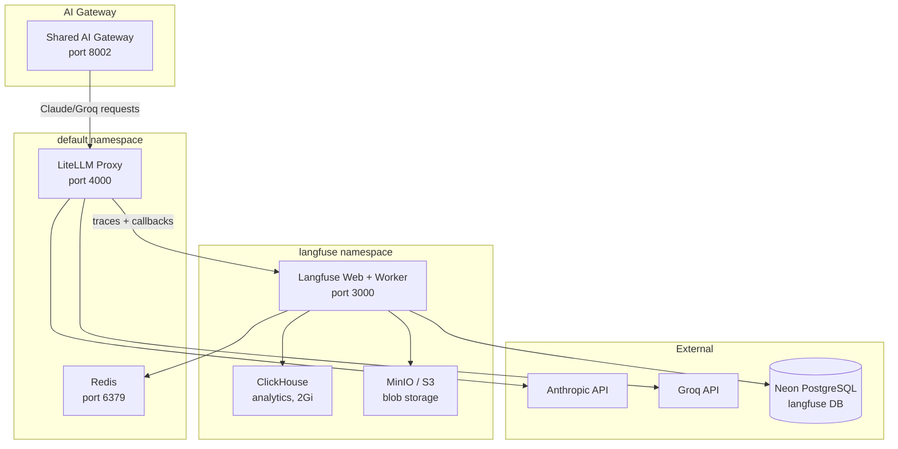

# Langfuse (LLM Observability)

**Langfuse** provides tracing, analytics, and cost tracking for all LLM calls made through the [Shared AI Gateway](./shared-ai-gateway). It captures every request/response, token usage, and latency metric via the **LiteLLM** proxy.

**URL:** `https://langfuse.el-jefe.me` | **Namespace:** `langfuse`

## Architecture



## How Tracing Works

1. The **Shared AI Gateway** routes Claude and Groq requests through **LiteLLM** instead of calling APIs directly
2. LiteLLM provides an OpenAI-compatible interface and sends **success/failure callbacks** to Langfuse
3. Langfuse records the full trace: prompt, response, tokens, latency, model, cost
4. Traces are stored in **ClickHouse** (analytics) and **Neon PostgreSQL** (metadata)

### LiteLLM Configuration

LiteLLM routes models and enables Langfuse callbacks:

```yaml
model_list:
  - model_name: claude-sonnet
    litellm_params:
      model: anthropic/claude-sonnet-4-20250514
      api_key: "os.environ/ANTHROPIC_API_KEY"

  - model_name: groq-llama
    litellm_params:
      model: groq/llama-3.3-70b-versatile
      api_key: "os.environ/GROQ_API_KEY"

litellm_settings:
  drop_params: true
  success_callback: ["langfuse"]
  failure_callback: ["langfuse"]
```

LiteLLM connects to Langfuse via environment variables:

```bash
LANGFUSE_PUBLIC_KEY=pk-lf-...
LANGFUSE_SECRET_KEY=sk-lf-...
LANGFUSE_HOST=http://langfuse-web.langfuse.svc.cluster.local:3000
```

## Helm Deployment

Langfuse is deployed via the official Helm chart with external PostgreSQL (Neon) and Redis:

```yaml
langfuse:
  telemetryEnabled: false
  nextauth:
    url: "https://langfuse.el-jefe.me"

# External PostgreSQL (Neon)
postgresql:
  deploy: false
  host: "ep-flat-resonance-addiekdb.c-2.us-east-1.aws.neon.tech"
  port: 5432
  auth:
    username: "neondb_owner"
    database: "langfuse"
    existingSecret: langfuse-postgresql
  args: "sslmode=require"

# External Redis (shared cluster Redis)
redis:
  deploy: false
  host: "redis.default.svc.cluster.local"
  port: 6379
  auth:
    existingSecret: redis-secrets

# ClickHouse (deployed with Langfuse)
clickhouse:
  deploy: true
  replicaCount: 1
  persistence:
    size: 2Gi
  resources:
    requests:
      memory: "1Gi"
      cpu: "100m"
    limits:
      memory: "4Gi"
      cpu: "1"
  startupProbe:
    enabled: true
    failureThreshold: 30  # 5 minutes for large dataset loading

# S3/MinIO for blob storage
s3:
  deploy: true

service:
  type: ClusterIP
  port: 3000
replicaCount: 1
```

## Secrets

All secrets are managed via External Secrets Operator (Doppler):

| Secret | Keys | Purpose |
|--------|------|---------|
| `langfuse-salt` | `salt` | Data encryption salt |
| `langfuse-encryption` | `encryption-key` | Encryption key |
| `langfuse-nextauth` | `nextauth-secret` | NextAuth.js session secret |
| `langfuse-postgresql` | `postgres-password` | Neon database credential |
| `redis-secrets` | `redis-password` | Shared Redis credential |
| `langfuse-clickhouse` | `admin-password` | ClickHouse admin password |
| `langfuse-s3` | `root-user`, `root-password` | MinIO credentials |
| `langfuse-credentials` | `LANGFUSE_PUBLIC_KEY`, `LANGFUSE_SECRET_KEY` | LiteLLM integration keys |

## Network Policy

Redis access is restricted via NetworkPolicy — only backend components and Langfuse workers can reach port 6379:

```yaml
ingress:
  - from:
    - podSelector:
        matchLabels:
          component: backend
    - namespaceSelector:
        matchLabels:
          kubernetes.io/metadata.name: langfuse
      podSelector:
        matchLabels:
          app: worker
          app.kubernetes.io/name: langfuse
    ports:
    - port: 6379
```

## What Langfuse Captures

| Data | Description |
|------|-------------|
| **Traces** | Full request lifecycle with timing |
| **Generations** | Model inputs, outputs, and parameters |
| **Token usage** | Prompt and completion token counts |
| **Latency** | End-to-end and per-generation timing |
| **Cost** | Estimated cost per model/request |
| **Sessions** | Grouped multi-turn conversations |
| **Errors** | Failed requests with error details |

## ClickHouse Considerations

ClickHouse handles Langfuse's analytics queries. On startup it can load large datasets (3GB+), so the startup probe allows up to 5 minutes (`failureThreshold: 30 × periodSeconds: 10`) before liveness checks begin. Without this, Kubernetes kills the container during initial data loading.

## Verification

```bash
# Check pod status
kubectl get pods -n langfuse

# Port-forward to UI
kubectl port-forward -n langfuse svc/langfuse 3000:3000

# Test via LiteLLM
curl http://localhost:4000/v1/chat/completions \
  -H "Content-Type: application/json" \
  -d '{"model": "claude-sonnet", "messages": [{"role": "user", "content": "Hello"}]}'

# Check Langfuse UI at http://localhost:3000 for the trace
```
