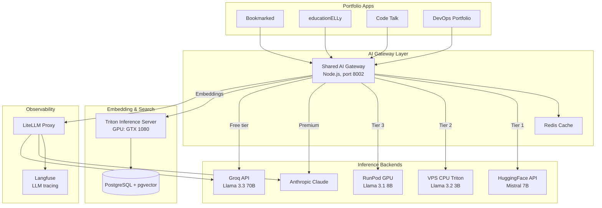

# AI / ML Infrastructure

The platform includes a self-hosted AI inference stack that provides embedding generation, text generation, and LLM observability across all portfolio applications.

## Architecture

## Components

| Component | Purpose | Technology |
|-----------|---------|------------|
| [**Shared AI Gateway**](./shared-ai-gateway) | Unified API for all AI features | Node.js/Express with multi-tier fallback |
| [**Triton Semantic Search**](./triton-semantic-search) | GPU-accelerated embeddings and code search | NVIDIA Triton + ONNX + pgvector |
| [**Langfuse**](./langfuse) | LLM observability and tracing | Langfuse + ClickHouse + LiteLLM |

## Design Principles

- **Cost optimization** — Free/cheap backends first (HuggingFace, Groq), expensive only when needed (Anthropic, RunPod)
- **Reliability** — Multi-tier fallback ensures AI features never go down
- **Observability** — Every LLM call is traced through Langfuse via LiteLLM
- **Self-hosted where possible** — Triton on local GPU, llama.cpp on VPS, reduces external dependencies
- **Shared infrastructure** — One gateway serves all portfolio apps instead of duplicating AI logic per app
