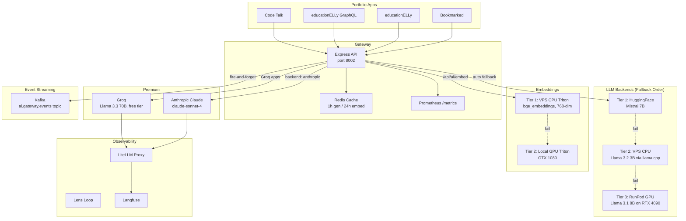
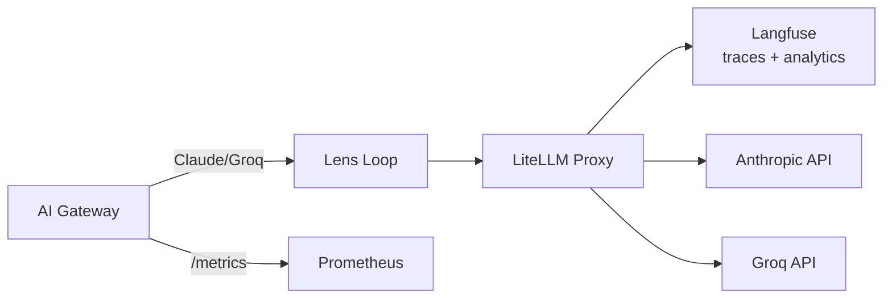

# Shared AI Gateway

A Node.js/Express API gateway that provides unified AI inference to all portfolio applications. It abstracts multiple LLM backends behind a single API with intelligent fallback, Redis caching, Kafka event streaming, and Prometheus metrics.

**Port:** 8002 | **Image:** `maxjeffwell/shared-ai-gateway` | **Runtime:** Node.js 20 Alpine

## Architecture



## Fallback Strategy

The gateway uses a tiered fallback system — cheapest/fastest first, escalating only on failure:

| Tier | Backend | Model | Latency | Cost |
|------|---------|-------|---------|------|
| 1 | HuggingFace Inference API | Mistral 7B Instruct v0.3 | 500ms–2s | ~$0.00001/token |
| 2 | VPS CPU (llama.cpp) | Llama 3.2 3B Instruct | 5–30s | Fixed (VPS) |
| 3 | RunPod Serverless | Llama 3.1 8B Instruct (RTX 4090) | 1–5s | Pay-per-use |

**Groq override:** Apps in the Groq list (`code-talk`, `educationelly`, `educationelly-graphql`, `bookmarks`) route to Groq's free Llama 3.3 70B tier instead of the fallback chain.

**Anthropic override:** Requests with `"backend": "anthropic"` use Claude via LiteLLM for observability, falling back to the native SDK if LiteLLM is unavailable.

## API Endpoints

### Text Generation

#### `POST /api/ai/generate`

General-purpose text generation with app-specific system prompts.

```json
{
  "prompt": "Explain React hooks",
  "app": "education",
  "maxTokens": 512,
  "temperature": 0.7,
  "backend": "auto"
}
```

#### `POST /api/ai/chat`

Multi-turn conversational chat with context awareness.

```json
{
  "messages": [
    { "role": "user", "content": "Explain ELL proficiency levels" }
  ],
  "context": {
    "app": "educationelly",
    "userRole": "teacher",
    "gradeLevel": 5,
    "ellStatus": "LEP",
    "nativeLanguage": "Spanish"
  }
}
```

### Specialized Endpoints

| Endpoint | Purpose | Notes |
|----------|---------|-------|
| `POST /api/ai/tags` | Generate bookmark tags | Dual mode: instant keyword extraction or AI-enhanced |
| `POST /api/ai/describe` | Generate bookmark descriptions | From title + URL |
| `POST /api/ai/explain-code` | Explain code snippets | Language-aware |
| `POST /api/ai/flashcard` | Generate flashcards from content | Topic + content → Q&A pair |
| `POST /api/ai/quiz` | Generate quiz questions | Difficulty levels: easy/medium/hard |

### Embeddings

#### `POST /api/ai/embed`

Generate embeddings via Triton (KServe V2 protocol). Supports single text or batch:

```json
{
  "texts": ["Text 1", "Text 2", "Text 3"]
}
```

Returns 768-dimensional BGE embeddings with 2-tier fallback (VPS CPU → local GPU).

### Health & Metrics

| Endpoint | Purpose |
|----------|---------|
| `GET /health` | Backend status, cache state, active tiers |
| `GET /metrics` | Prometheus metrics (requests, duration, fallbacks, cache hits) |

## Caching

Redis-backed caching reduces latency and cost:

- **Generation:** 1-hour TTL, only for low-temperature requests (≤0.5)
- **Embeddings:** 24-hour TTL
- **Key:** SHA256 hash of prompt + options
- **Graceful degradation:** If Redis disconnects, requests proceed without cache

## System Prompts

Pre-configured prompts per application context:

| App | System Prompt |
|-----|--------------|
| `bookmarks` | Bookmark tagging and categorization |
| `education` | Educational content creation |
| `educationChat` | ELL teacher/student support (adapts to role, grade, language) |
| `code` | Code analysis and explanation |
| `flashcard` | Flashcard Q&A generation |
| `quiz` | Quiz question generation with difficulty |
| `describe` | Bookmark URL description |
| `general` | General-purpose assistant |

## Kafka Event Streaming

Every AI request (success or error) emits a metadata-only event to Kafka for analytics and downstream processing.

**Topic:** `ai.gateway.events` | **Broker:** Vertex Kafka in `microservices` namespace

### Event Schema

```json
{
  "eventId": "uuid",
  "timestamp": 1707600000000,
  "endpoint": "/api/ai/generate",
  "app": "bookmarks",
  "backend": "groq",
  "model": "llama-3.3-70b-versatile",
  "status": "success",
  "latencyMs": 342,
  "usage": { "promptTokens": 128, "completionTokens": 256 },
  "fromCache": false
}
```

**Privacy:** No prompt or response text is included — only request metadata, timing, and token counts.

**Fire-and-forget pattern:** Events are sent asynchronously and never block AI responses. If Kafka is unavailable, the gateway logs a warning and continues serving requests normally.

**Producer resilience:** The KafkaJS producer uses infinite retry with exponential backoff (2s initial, 30s max). If KafkaJS's internal retries exhaust, the producer instance is recreated transparently.

### Startup Race Condition Fix

The gateway pod uses an **init container** to wait for Kafka availability before starting the main application:

```yaml
initContainers:
  - name: wait-for-kafka
    image: busybox:1.37
    command: ['sh', '-c', 'until nc -z vertex-kafka-kafka-bootstrap.microservices.svc 9092; do echo "Waiting for Kafka..."; sleep 5; done']
```

This prevents the chicken-and-egg problem where the gateway starts before Kafka is ready. The init container polls every 5 seconds with `nc -z` (TCP connectivity check) and only allows the main container to start once Kafka is reachable.

**Network policy:** Dedicated egress rules allow the AI gateway and GraphQL gateway to reach port 9092 in the `microservices` namespace.

## Kubernetes Deployment

```yaml
# 1 replica, ClusterIP service on port 8002
resources:
  requests:
    cpu: 100m
    memory: 256Mi
  limits:
    cpu: 500m
    memory: 512Mi
```

**Network policy:** Only pods with `portfolio: "true"` label can reach port 8002.

**Secrets** (via `ai-gateway-credentials`):
- `GROQ_API_KEY`
- `ANTHROPIC_API_KEY`
- `RUNPOD_API_KEY`
- `RUNPOD_ENDPOINT_ID`

## CI/CD

GitHub Actions workflow on push to `main`:
1. Checkout → Install Doppler CLI → Setup Docker Buildx
2. Login to Docker Hub (credentials from Doppler)
3. Build and push: `maxjeffwell/shared-ai-gateway:latest` + `:<commit-sha>`

## Observability



**Prometheus metrics:**

| Metric | Type | Labels |
|--------|------|--------|
| `gateway_requests_total` | Counter | backend, endpoint, status |
| `gateway_request_duration_seconds` | Histogram | backend, endpoint |
| `gateway_fallback_total` | Counter | from_tier, to_tier |
| `gateway_cache_total` | Counter | result (hit/miss) |
| `gateway_backend_healthy` | Gauge | backend |

**Langfuse tracing:** Claude and Groq requests route through LiteLLM, which sends traces to Langfuse for cost tracking, latency analysis, and prompt debugging.
