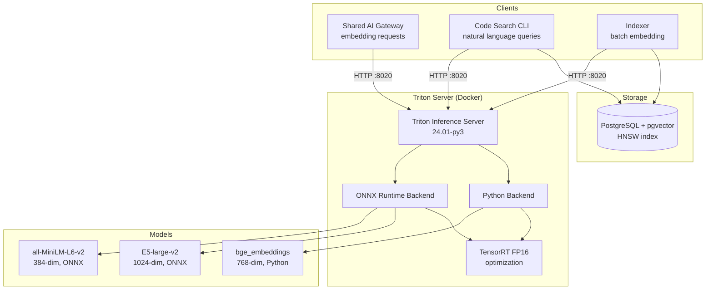
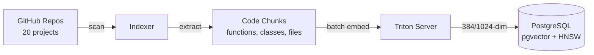

# Triton Semantic Search

GPU-accelerated semantic search using **NVIDIA Triton Inference Server** with ONNX Runtime and TensorRT optimization. Provides embedding generation for the [Shared AI Gateway](./shared-ai-gateway) and powers a code search system indexed against all portfolio repositories.

**GPU:** NVIDIA GTX 1080 | **Latency:** 2–5ms | **Throughput:** 500–1000 sentences/sec

## Architecture



## Models

Three embedding models are served simultaneously, each optimized for different use cases:

| Model | Backend | Dimensions | Max Batch | Use Case |
|-------|---------|-----------|-----------|----------|
| `all-MiniLM-L6-v2` | ONNX Runtime | 384 | 32 | Fast general-purpose embeddings |
| `e5-large-v2` | ONNX Runtime | 1024 | 16 | Higher-quality semantic search |
| `bge_embeddings` | Python (ONNX) | 768 | 32 | Gateway default, balanced quality/speed |

### Model Configuration (all-MiniLM-L6-v2)

```protobuf
name: "all-minilm-l6-v2"
backend: "onnxruntime"
max_batch_size: 32

input [
  { name: "input_ids",      data_type: TYPE_INT64, dims: [ -1 ] },
  { name: "attention_mask",  data_type: TYPE_INT64, dims: [ -1 ] },
  { name: "token_type_ids",  data_type: TYPE_INT64, dims: [ -1 ] }
]

output [
  { name: "last_hidden_state", data_type: TYPE_FP32, dims: [ -1, 384 ] }
]

instance_group [
  { count: 1, kind: KIND_GPU, gpus: [ 0 ] }
]

dynamic_batching {
  preferred_batch_size: [ 4, 8, 16, 32 ]
  max_queue_delay_microseconds: 5000
}
```

### BGE Python Backend

The BGE model uses a custom Triton Python backend that handles tokenization internally — clients send raw text instead of pre-tokenized input:

```protobuf
input  [ { name: "text",       data_type: TYPE_STRING, dims: [ 1 ] } ]
output [ { name: "embeddings", data_type: TYPE_FP32,   dims: [ 768 ] } ]
```

The Python backend:
1. Loads the ONNX model and HuggingFace tokenizer at startup
2. Detects best execution provider (TensorRT → CUDA → CPU)
3. Configures TensorRT FP16 with 2GB workspace and engine caching
4. Tokenizes input text (max 512 tokens)
5. Runs ONNX inference, extracts sentence embeddings, L2-normalizes

## Docker Deployment

```yaml
services:
  triton:
    image: nvcr.io/nvidia/tritonserver:24.01-py3
    ports:
      - "8020:8000"  # HTTP
      - "8021:8001"  # gRPC
      - "8022:8002"  # Metrics
    volumes:
      - ./models:/models
    command: tritonserver --model-repository=/models --log-verbose=1
    runtime: nvidia
    environment:
      - NVIDIA_VISIBLE_DEVICES=GPU-8060da56-7daf-3ffb-07ad-102325b750f5
    healthcheck:
      test: ["CMD", "curl", "-f", "http://localhost:8000/v2/health/ready"]
      interval: 30s
      start_period: 120s  # TensorRT compilation on first start
    restart: unless-stopped
```

**Ports:**

| Port | Protocol | Purpose |
|------|----------|---------|
| 8020 | HTTP | REST inference API |
| 8021 | gRPC | High-performance inference |
| 8022 | HTTP | Prometheus metrics |

The 120-second start period accounts for TensorRT engine compilation on first launch — subsequent starts use the cached engines in `trt_cache/`.

## Code Search System

A complete semantic search pipeline for querying code across all portfolio repositories using natural language.

### Indexing Pipeline



The indexer (`code_search/indexer.py`):
1. Recursively scans repository directories
2. Extracts code chunks by language (Python: functions/classes, others: whole files)
3. Generates embeddings in batches of 16 via Triton
4. Stores in PostgreSQL with pgvector and HNSW indexes

**Supported languages:** Python, JavaScript, TypeScript, Go, Rust, Java, C++, C, Ruby, PHP, SQL, Bash, Markdown

### Database Schema

Two tables for different embedding models:

```sql
-- 384-dim MiniLM embeddings
CREATE TABLE code_embeddings (
    id SERIAL PRIMARY KEY,
    repo_name TEXT NOT NULL,
    file_path TEXT NOT NULL,
    chunk_type TEXT NOT NULL,     -- function, class, file
    name TEXT,
    content TEXT NOT NULL,
    start_line INTEGER,
    end_line INTEGER,
    embedding vector(384) NOT NULL,
    language TEXT,
    indexed_at TIMESTAMP DEFAULT NOW(),
    UNIQUE(repo_name, file_path, chunk_type, name, start_line)
);

-- HNSW index for fast similarity search
CREATE INDEX ON code_embeddings
    USING hnsw (embedding vector_cosine_ops);
```

An equivalent `code_embeddings_e5` table exists with `vector(1024)` for E5 embeddings.

### Search CLI

```bash
# Natural language code search
./search-code "authentication middleware with JWT"

# Filter by repository and language
python search.py --query "database connection pooling" \
    --repo bookmarked --language python --limit 5
```

The search wrapper script (`search-code`) handles connectivity:
1. Check if Triton server is running
2. Try local VPS PostgreSQL (port 5433)
3. Fall back to Cloudflare tunnel if available
4. Fall back to Neon PostgreSQL if VPS is unreachable

### Batch Indexing

```bash
# Index all portfolio repositories
./index-all.sh
```

Scans all projects in `~/GitHub_Projects/`, skipping `node_modules`-heavy directories, and reports chunk counts per repository.

## Client Library

The Python client (`client/semantic_search.py`) provides a high-level API:

```python
from semantic_search import SemanticSearchClient

client = SemanticSearchClient(triton_url="localhost:8020")

# Generate embeddings
embeddings = client.encode(["React hooks tutorial", "Kubernetes deployment"])

# Similarity search
results = client.similarity(
    query="How to use useState",
    documents=["React hooks guide", "CSS flexbox tutorial", "useState examples"]
)
```

**Pipeline:** Tokenize (HuggingFace) → Triton inference → Mean pooling → L2 normalize → Cosine similarity

## Integration with AI Gateway

The Shared AI Gateway calls Triton as its embedding backend:

- **Tier 1 (primary):** VPS CPU Triton — `bge_embeddings` model, always available
- **Tier 2 (fallback):** Local GPU Triton — GTX 1080 via Cloudflare tunnel

The gateway uses the KServe V2 REST protocol:

```json
{
  "inputs": [{
    "name": "text",
    "shape": [1, 1],
    "datatype": "BYTES",
    "data": [["Text to embed"]]
  }]
}
```
