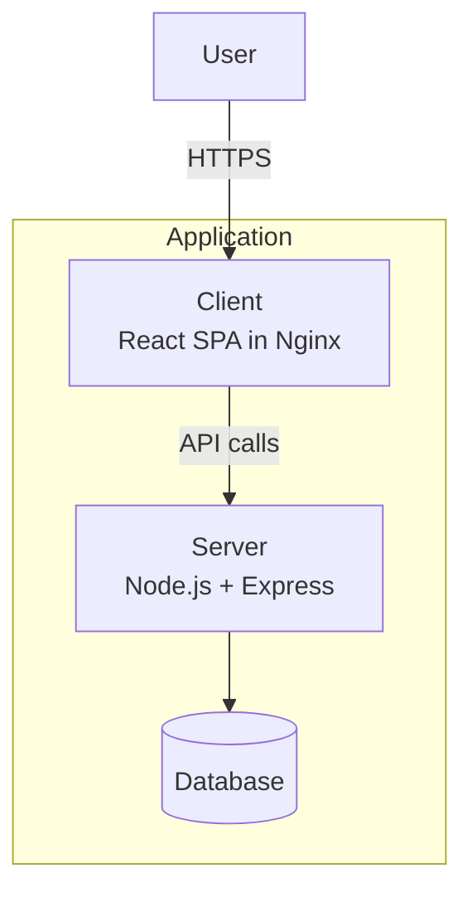

# Deployed Applications

All applications follow the same deployment pattern: GitHub Actions builds Docker images, pushes to Docker Hub, and triggers ArgoCD sync via the `devops-portfolio-manager` repository.

## Application Summary

| App | Domain | Frontend | Backend | Database | HPA |
|-----|--------|----------|---------|----------|-----|
| **Bookmarked** | bookmarked.el-jefe.me | React (Hooks) | Node.js + Express | PostgreSQL (Neon + pgvector) | Yes |
| **educationELLy** | educationelly.el-jefe.me | React | Node.js + Express | MongoDB | Yes |
| **educationELLy GraphQL** | educationelly-graphql.el-jefe.me | React + Apollo Client | Node.js + Apollo Server | MongoDB | Yes |
| **IntervalAI** | intervalai.el-jefe.me | React | Node.js + Express | MongoDB | Yes |
| **Code Talk** | code-talk.el-jefe.me | React | Node.js + Express | PostgreSQL + Redis | No |
| **TenantFlow** | tenantflow.el-jefe.me | React | Node.js + Express | PostgreSQL | Yes |
| **PodRick** | podrick.el-jefe.me | React | — | K8s API | No |
| **Portfolio** | el-jefe.me | Gatsby | — | — | Yes |
| **k8s-ui-library** | showcase.el-jefe.me | Storybook | — | — | No |

## Component Showcase

Each application's UI components are extracted and displayed in the [Storybook Showcase](https://showcase.el-jefe.me) with interactive stories, mock data, and play-function tests.

| App | Stories | Highlights |
|-----|---------|------------|
| [**Bookmarked**](https://showcase.el-jefe.me/?path=/story/bookmarked-bookmarkform--create-new) | BookmarkForm, SemanticSearch, Header, Footer, Landing | Emotion theming, pgvector semantic search UI |
| [**educationELLy**](https://showcase.el-jefe.me/?path=/story/educationelly-studentlist--default) | StudentList, Pagination, ChatBubble, Header, LoadingSpinner | Semantic UI components |
| [**educationELLy GraphQL**](https://showcase.el-jefe.me/?path=/story/educationelly-graphql-createstudent--default) | CreateStudent, Students, ChatBubble, Header | Apollo Client integration patterns |
| [**IntervalAI**](https://showcase.el-jefe.me/?path=/story/intervalai-statsdashboard--default) | StatsDashboard, LearningPage, MLStatus, NeuralNetworkVisualizer | ML visualization, Tailwind v4 |
| [**Code Talk**](https://showcase.el-jefe.me/?path=/story/code-talk-editor--default) | Editor, MessageContainer, RoomCreate, RoomGrid, RoomList | Real-time chat UI, styled-components |
| [**TenantFlow**](https://showcase.el-jefe.me/?path=/story/tenantflow-tenantcard--default) | TenantCard, Navigation, MetricsCharts, DeploymentControls | MUI v7, multi-tenant dashboard |
| [**PodRick**](https://showcase.el-jefe.me/?path=/story/podrick-applicationcard--default) | ApplicationCard, WorkflowCard, PipelineTimeline | K8s dashboard, CSS variables |
| [**FireBook**](https://showcase.el-jefe.me/?path=/story/firebook-bookmarkcard--default) | BookmarkCard, EditBookmarkModal, AlgoliaSearch, ErrorBoundary | CSS Modules, Algolia search |
| [**Pop!_Portfolio**](https://showcase.el-jefe.me/?path=/story/pop-portfolio-layout--default) | Layout, ConnectionStatus, NotificationBell | Pure CSS, notification patterns |

## Architecture Pattern

Most applications follow a client-server split:

### Exceptions

- **PodRick**: Dashboard-only app that talks to the K8s API directly
- **Portfolio**: Static Gatsby site, no backend
- **k8s-ui-library**: Static Storybook, no backend
