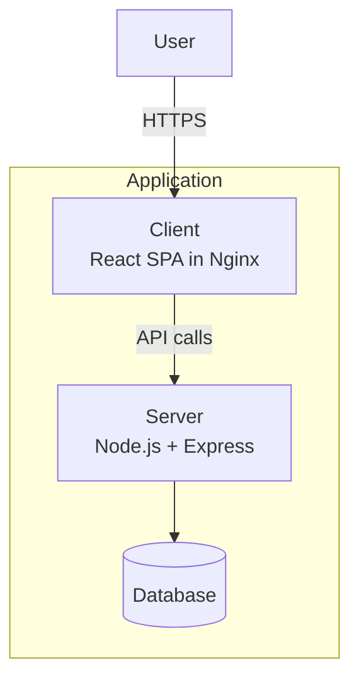

# Deployed Applications

All applications follow the same deployment pattern: GitHub Actions builds Docker images, pushes to Docker Hub, and triggers ArgoCD sync via the `devops-portfolio-manager` repository.

## Application Summary

| App | Domain | Frontend | Backend | Database | HPA |
|-----|--------|----------|---------|----------|-----|
| **Bookmarked** | bookmarked.el-jefe.me | React (Hooks) | Node.js + Express | PostgreSQL (Neon + pgvector) | Yes |
| **educationELLy** | educationelly.el-jefe.me | React | Node.js + Express | MongoDB | Yes |
| **educationELLy GraphQL** | educationelly-graphql.el-jefe.me | React + Apollo Client | Node.js + Apollo Server | MongoDB | Yes |
| **IntervalAI** | intervalai.el-jefe.me | React | Node.js + Express | MongoDB | Yes |
| **Code Talk** | code-talk.el-jefe.me | React | Node.js + Express | PostgreSQL + Redis | No |
| **TenantFlow** | tenantflow.el-jefe.me | React | Node.js + Express | PostgreSQL | Yes |
| **PodRick** | podrick.el-jefe.me | React | — | K8s API | No |
| **Portfolio** | el-jefe.me | Gatsby | — | — | Yes |
| **k8s-ui-library** | showcase.el-jefe.me | Storybook | — | — | No |

## Architecture Pattern

Most applications follow a client-server split:

### Exceptions

- **PodRick**: Dashboard-only app that talks to the K8s API directly
- **Portfolio**: Static Gatsby site, no backend
- **k8s-ui-library**: Static Storybook, no backend
