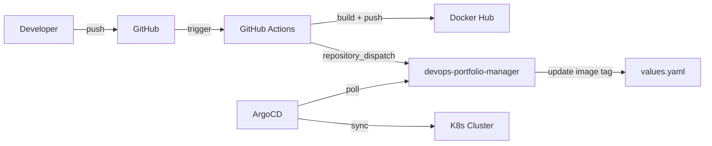
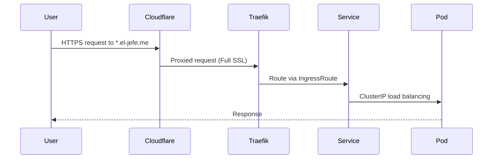

# System Architecture Overview

The platform follows a GitOps-driven architecture where all infrastructure and application state is declared in Git and reconciled by ArgoCD.

## High-Level Flow



## Key Design Decisions

### GitOps with ArgoCD

All deployment state lives in the `devops-portfolio-manager` repository. Application repos contain only source code and CI workflows — they never directly interact with the cluster. This separation means:

- **Audit trail**: Every deployment is a Git commit
- **Rollback**: `git revert` undoes any deployment
- **Single source of truth**: The cluster state always matches Git

### Shared Library Chart

The `portfolio-common` Helm library chart provides standardized templates for Deployments, Services, Ingresses, HPAs, and ServiceMonitors. Each application's Helm chart is a thin wrapper:

```yaml
# Example: bookmarked/templates/deployment.yaml
{{- include "portfolio-common.deployment" (dict "component" "client" "context" $) }}
```

This ensures consistency across all 9 applications while allowing per-app overrides via `values.yaml`.

### Image Tagging Strategy

Images are tagged with `YYYYMMDD-HHMMSS-shortsha` format (e.g., `20250205-143022-a1b2c3d`). This provides:

- **Chronological sorting** — newest images sort last
- **Traceability** — the Git SHA links back to the exact commit
- **Uniqueness** — timestamp + SHA prevents collisions

## Networking



All traffic flows through Cloudflare (DNS proxy mode), which terminates the first TLS hop. Traefik handles the second hop with certificates issued by cert-manager via Let's Encrypt.
