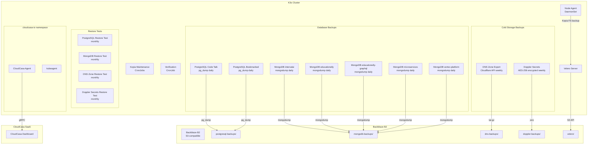

# Backup Strategy

The platform uses a multi-layer backup architecture: **Velero** for Kubernetes-native volume snapshots, **database-specific CronJobs** for logical dumps, **DNS and secrets cold storage**, and **CloudCasa** as a SaaS-managed secondary layer. All off-cluster backups target **Backblaze B2**.

## Architecture



## Backup Overview

### All CronJobs

| CronJob | Schedule | Target | Retention | Image |
|---------|----------|--------|-----------|-------|
| **Velero daily** | `0 2 * * *` (2:00 AM) | All PVs across 8 namespaces | 7 days | velero/velero:v1.14.0 |
| **Velero weekly** | `0 3 * * 0` (Sun 3:00 AM) | All PVs across 8 namespaces | 30 days | velero/velero:v1.14.0 |
| **postgresql-backup** (Code Talk) | `30 3 * * *` (3:30 AM) | codetalk database | 30 days | postgres:14-alpine |
| **postgresql-bookmarked-backup** | `45 3 * * *` (3:45 AM) | bookmarked database | 30 days | postgres:14-alpine |
| **mongodb-backup** (intervalai) | `0 3 * * *` (3:00 AM) | intervalai database | 30 days | maxjeffwell/mongodb-backup |
| **mongodb-backup-educationelly** | `5 3 * * *` (3:05 AM) | educationelly database | 30 days | maxjeffwell/mongodb-backup |
| **mongodb-backup-educationelly-graphql** | `10 3 * * *` (3:10 AM) | educationelly-graphql database | 30 days | maxjeffwell/mongodb-backup |
| **mongodb-backup-microservices** | `15 3 * * *` (3:15 AM) | microservices database | 30 days | maxjeffwell/mongodb-backup |
| **mongodb-backup-vertex-platform** | `20 3 * * *` (3:20 AM) | vertex-platform database | 30 days | maxjeffwell/mongodb-backup |
| **dns-zone-backup** | `0 4 * * 0` (Sun 4:00 AM) | Cloudflare DNS records | 12 weeks | alpine:3.21 |
| **doppler-secrets-backup** | `0 5 * * 0` (Sun 5:00 AM) | All Doppler secrets | 12 weeks | alpine:3.21 |

### All Restore Tests

| CronJob | Schedule | What It Tests |
|---------|----------|---------------|
| **velero-backup-verify** | `0 4 * * 0` (weekly Sun) | Velero BSL health, backup age, test restore of default namespace |
| **postgresql-restore-test** | `0 6 1-7 * 0` (1st Sun monthly) | Download + pg_restore of codetalk and bookmarked dumps |
| **mongodb-restore-test** | `30 6 1-7 * 0` (1st Sun monthly) | Download + mongorestore of all 5 MongoDB databases |
| **dns-zone-restore-test** | `0 7 1-7 * 0` (1st Sun monthly) | Download + extract tarball, validate JSON, compare against live Cloudflare |
| **doppler-secrets-restore-test** | `15 7 1-7 * 0` (1st Sun monthly) | Download + AES-256 decrypt, validate JSON, compare against live Doppler |

---

## Velero (Primary — Volume Snapshots)

Velero v1.14.0 handles all scheduled volume-level backups with file-system protection via Kopia.

### Backup Schedules

| Schedule | Cron | Retention |
|----------|------|-----------|
| **Daily** | `0 2 * * *` (2:00 AM) | 7 days (168h) |
| **Weekly** | `0 3 * * 0` (3:00 AM Sun) | 30 days (720h) |

Both schedules use `defaultVolumesToFsBackup: true`, meaning all PVs are backed up at the filesystem level through Kopia rather than relying on CSI volume snapshots.

### Protected Namespaces

```yaml
includedNamespaces:
  - default
  - monitoring
  - microservices
  - vertex-platform
  - argocd
  - cert-manager
  - gpu-operator
  - keel
```

### Storage Backend

| Setting | Value |
|---------|-------|
| **Provider** | AWS-compatible (Backblaze B2) |
| **Bucket** | Private B2 bucket |
| **Prefix** | `velero/` |
| **Path style** | `s3ForcePathStyle: true` |
| **Access mode** | ReadWrite |

Credentials are stored as a Kubernetes Secret in the `velero` namespace.

### Kopia Maintenance

Velero runs Kopia repository maintenance jobs on a per-namespace basis. These compact, deduplicate, and verify the backup repository in B2:

| Namespace | Frequency |
|-----------|-----------|
| default | ~65 min |
| argocd | ~65 min |
| microservices | ~65 min |
| monitoring | ~65 min |
| vertex-platform | ~65 min |

### Components

| Component | Type | Purpose |
|-----------|------|---------|
| `velero` Deployment | Server | Backup orchestration, schedule management, S3 communication |
| `node-agent` DaemonSet | Agent | Filesystem-level PV backup via Kopia on each node |
| `velero-backup-verify` CronJob | Verifier | Weekly automated restore validation |

---

## Database Backups (Logical Dumps)

Database CronJobs provide application-consistent logical backups that complement Velero's filesystem-level snapshots. Each dump is uploaded to the B2 bucket under database-specific prefixes.

### PostgreSQL Backups

Two PostgreSQL databases are backed up daily via `pg_dump`:

| CronJob | Database | Host | Schedule | B2 Prefix |
|---------|----------|------|----------|-----------|
| `postgresql-backup` | codetalk | `postgresql-codetalk` | 3:30 AM | `postgresql-backups/codetalk-*` |
| `postgresql-bookmarked-backup` | bookmarked | `postgresql-bookmarked` | 3:45 AM | `postgresql-backups/bookmarked-*` |

**Dump format:** Custom (`-Fc`) with `--no-owner` for portability.

**Cleanup:** Each CronJob deletes its own backups older than 30 days, scoped by prefix (`grep 'codetalk-'` / `grep 'bookmarked-'`) to prevent cross-deletion.

**Secrets:**
- Database passwords from `postgresql-codetalk-secrets` / `postgresql-bookmarked-secrets`
- B2 credentials from `velero-b2-credentials`

### MongoDB Backups

Five MongoDB databases are backed up daily via `mongodump --archive --gzip`:

| CronJob | Database | Schedule | B2 Prefix |
|---------|----------|----------|-----------|
| `mongodb-backup` | intervalai | 3:00 AM | `mongodb-backups/intervalai-*` |
| `mongodb-backup-educationelly` | educationelly | 3:05 AM | `mongodb-backups/educationelly-*` |
| `mongodb-backup-educationelly-graphql` | educationelly-graphql | 3:10 AM | `mongodb-backups/educationelly-graphql-*` |
| `mongodb-backup-microservices` | microservices | 3:15 AM | `mongodb-backups/microservices-*` |
| `mongodb-backup-vertex-platform` | vertex-platform | 3:20 AM | `mongodb-backups/vertex-platform-*` |

**Image:** `maxjeffwell/mongodb-backup:latest` — custom image with MongoDB tools + AWS CLI pre-installed (avoids apt-get IPv6 failures on `mongo:7-jammy` in the cluster).

**Cleanup:** Each CronJob scopes deletion by its own prefix.

**Secrets:**
- MongoDB credentials from per-database ExternalSecrets (microservices, vertex-platform) or inline connection strings (default namespace)
- B2 credentials from `velero-b2-credentials`

---

## Cold Storage Backups

### DNS Zone Backup

Weekly export of all Cloudflare DNS records for the `el-jefe.me` zone, providing disaster recovery if the Cloudflare account or zone is lost.

**Schedule:** Sunday 4:00 AM | **Image:** `alpine:3.21` | **B2 prefix:** `dns-backups/`

**What's captured:**
- `all_records.json` — Paginated Cloudflare API export of all DNS records (JSON)
- `zone_settings.json` — Zone-level settings (SSL mode, security level, etc.)
- `zone-export.txt` — BIND-format zone file (can be imported into any DNS provider)

**Package:** `dns-zone-TIMESTAMP.tar.gz` | **Retention:** 12 weekly backups (3 months)

### Doppler Secrets Backup

Weekly encrypted cold-storage export of all secrets from Doppler, providing recovery if the Doppler account is compromised or unavailable.

**Schedule:** Sunday 5:00 AM | **Image:** `alpine:3.21` | **B2 prefix:** `doppler-backups/`

**Security:**
- Secrets are downloaded as JSON via the Doppler API
- Immediately encrypted with **AES-256-CBC** (PBKDF2, 100k iterations) using a passphrase from `doppler-backup-encryption` Secret
- Plaintext is deleted before upload; only the encrypted `.enc` file reaches B2
- Secret values never appear in pod logs

**Retention:** 12 weekly backups (3 months)

---

## Restore Testing

All backup types have automated restore tests that run monthly on the first Sunday. Tests validate that backups are downloadable, recent, structurally valid, and can be successfully restored.

### Velero Backup Verify

**Schedule:** `0 4 * * 0` (weekly Sunday)

1. Confirms BackupStorageLocation is `Available`
2. Finds the most recent successful daily backup
3. Fails if the latest backup is older than 48 hours
4. Restores the `default` namespace into a temporary `velero-test-restore` namespace
5. Verifies restore completed successfully
6. Cleans up the test namespace and restore object

### PostgreSQL Restore Test

**Schedule:** `0 6 1-7 * 0` (first Sunday monthly) | **Image:** `postgres:14-alpine`

For each database (codetalk, bookmarked):
1. Downloads the latest dump from B2
2. Checks backup age (warns if > 2 days)
3. Starts a local PostgreSQL instance via `pg_ctl`
4. Runs `pg_restore` into a test database
5. Validates table count and row counts via `pg_stat_user_tables`
6. Reports PASS/FAIL per database

:::note Alpine Date Compatibility
Alpine's BusyBox `date` doesn't accept bare `YYYYMMDD` format. The test converts timestamps to `YYYY-MM-DD` with `sed` before passing to `date -d`.
:::

### MongoDB Restore Test

**Schedule:** `30 6 1-7 * 0` (first Sunday monthly) | **Image:** `maxjeffwell/mongodb-backup:latest`

For each database (intervalai, educationelly, educationelly-graphql, microservices, vertex-platform):
1. Downloads the latest archive from B2
2. Checks backup age (warns if > 2 days)
3. Starts a local `mongod` instance on port 27099
4. Runs `mongorestore --archive --gzip --drop`
5. Validates collection and document counts via `mongosh`
6. Empty databases (e.g. microservices, vertex-platform) pass with "restore mechanics verified"

:::note Grep Prefix Collision
The B2 file lookup uses `grep "${DB}-[0-9]"` instead of `grep "${DB}-"` to prevent `educationelly-` from matching `educationelly-graphql-` files. The `[0-9]` anchors to the timestamp digit that follows the database name.
:::

### DNS Zone Restore Test

**Schedule:** `0 7 1-7 * 0` (first Sunday monthly) | **Image:** `alpine:3.21`

Validates 5 checks:
1. **Backup age** — Must be < 8 days (weekly schedule)
2. **Tarball extraction** — Archive must decompress successfully
3. **DNS records JSON** — `all_records.json` must be valid JSON with record count > 0; reports type breakdown (A, CNAME, MX, TXT)
4. **Zone settings JSON** — `zone_settings.json` must be valid JSON; reports zone name
5. **Live comparison** — Queries live Cloudflare API and compares record count; warns if drift > 5

### Doppler Secrets Restore Test

**Schedule:** `15 7 1-7 * 0` (first Sunday monthly) | **Image:** `alpine:3.21`

Validates 4 checks:
1. **Backup age** — Must be < 8 days (weekly schedule)
2. **Decryption** — AES-256-CBC decrypt with the same passphrase must succeed
3. **JSON validation** — Decrypted output must be valid JSON with key count > 0; prints sample key names (never values)
4. **Live comparison** — Queries live Doppler API and compares key count; warns if drift > 3

---

## CloudCasa (Secondary)

CloudCasa provides a SaaS-managed backup layer. The agent runs in the `cloudcasa-io` namespace and communicates with CloudCasa's control plane — backup schedules and policies are managed from the CloudCasa web dashboard rather than through in-cluster CRDs.

| Component | Purpose |
|-----------|---------|
| `cloudcasa-kubeagent-manager` | Agent lifecycle management |
| `kubeagent` (2 containers) | Backup execution and data movement |

CloudCasa's CRDs (backups, restores, schedules, volume snapshot locations) are registered in the cluster but orchestrated from the SaaS side, providing an independent backup path that doesn't share Velero's storage or failure modes.

---

## What's Protected

### Stateful Data (Active Backup)

The following PVCs are actively backed up via Velero's filesystem-level Kopia snapshots:

| Namespace | PVC | Size | Storage Class |
|-----------|-----|------|---------------|
| **default** | `mongodb-educationelly-pvc` | 2Gi | local-path |
| **default** | `mongodb-educationelly-graphql-pvc` | 2Gi | local-path |
| **default** | `mongodb-intervalai-pvc` | 2Gi | local-path |
| **default** | `mongodb-data-mongodb-intervalai-0` | 8Gi | local-path |
| **default** | `postgresql-codetalk-pvc` | 2Gi | local-path |
| **default** | `redis-pvc` | 1Gi | local-path |
| **default** | `llm-models-pvc` | 100Gi | csi-s3 |
| **default** | `triton-models-pvc` | 50Gi | csi-s3 |
| **langfuse** | `data-langfuse-clickhouse-shard0-0` | 2Gi | local-path |
| **langfuse** | `langfuse-s3` | 8Gi | local-path |
| **microservices** | `mongodb` | 8Gi | local-path |
| **microservices** | `redis-data-redis-replicas-{0,1,2}` | 8Gi each | local-path |
| **microservices** | `data-vertex-kafka-*` | 5Gi | local-path |
| **monitoring** | `prometheus-*-db-*` (x2) | 50Gi each | local-path |
| **monitoring** | `prometheus-minio` | 20Gi | local-path |
| **monitoring** | `storage-prometheus-mimir-*` (x3) | 10Gi each | local-path |
| **monitoring** | `storage-prometheus-loki-0` | 5Gi | local-path |
| **monitoring** | `gotify-pvc` | 1Gi | local-path |
| **monitoring** | `alertmanager-*-db-*` | 2Gi | local-path |
| **monitoring** | `kafka-data-prometheus-mimir-kafka-0` | 5Gi | local-path |
| **vertex-platform** | `influxdb-data-pvc` | 5Gi | local-path |
| **vertex-platform** | `influxdb-config-pvc` | 100Mi | local-path |
| **vertex-platform** | `mongodb-pvc` | 5Gi | local-path |
| **vertex-platform** | `redis-pvc` | 1Gi | local-path |

### Declarative State (Protected by GitOps)

These don't need active backup — they can be fully reconstructed from Git:

| What | Source |
|------|--------|
| All Helm charts and values | `devops-portfolio-manager` repo |
| Application source code | Individual GitHub repos |
| CI/CD workflows | GitHub Actions in each repo |
| ArgoCD Applications | Git-managed in devops-portfolio-manager |
| Docker images | Docker Hub (tagged with `YYYYMMDD-HHMMSS-shortsha`) |
| TLS certificates | Auto-issued by cert-manager + Let's Encrypt |
| Secrets definitions | Doppler (source of truth) + ESO manifests in Git |

:::info Design Principle
If it's declarative and lives in Git, GitOps is the backup. Active backup targets only **stateful data** that can't be reconstructed: database contents, persistent volumes, and monitoring history. Database logical dumps provide an independent recovery path from Velero in case of filesystem-level corruption.
:::

---

## B2 Bucket Layout

All off-cluster backups share a single private B2 bucket organized by prefix:

```
s3://<bucket>/
├── velero/                     # Velero volume snapshots (managed by Velero)
├── postgresql-backups/
│   ├── codetalk-YYYYMMDD-HHMMSS.dump
│   └── bookmarked-YYYYMMDD-HHMMSS.dump
├── mongodb-backups/
│   ├── intervalai-YYYYMMDD-HHMMSS.archive
│   ├── educationelly-YYYYMMDD-HHMMSS.archive
│   ├── educationelly-graphql-YYYYMMDD-HHMMSS.archive
│   ├── microservices-YYYYMMDD-HHMMSS.archive
│   └── vertex-platform-YYYYMMDD-HHMMSS.archive
├── dns-backups/
│   └── dns-zone-YYYYMMDD-HHMMSS.tar.gz
└── doppler-backups/
    └── doppler-secrets-YYYYMMDD-HHMMSS.enc
```

All database dump CronJobs share the `velero-b2-credentials` Secret for B2 access. Bucket name and endpoint are configured via environment variables in each CronJob, not hardcoded in documentation.

---

## Restore Procedures

### Restore a Single Namespace (Velero)

```bash
velero restore create --from-backup daily-backup-YYYYMMDDHHMMSS \
  --include-namespaces default
```

### Restore to a Different Namespace

```bash
velero restore create --from-backup daily-backup-YYYYMMDDHHMMSS \
  --include-namespaces default \
  --namespace-mappings default:restored-default
```

### Restore a Specific Resource

```bash
velero restore create --from-backup daily-backup-YYYYMMDDHHMMSS \
  --include-namespaces default \
  --include-resources persistentvolumeclaims,persistentvolumes \
  --selector app=bookmarked
```

### Restore a PostgreSQL Database from B2

```bash
# Download the latest dump
aws s3 cp s3://${B2_BUCKET}/postgresql-backups/codetalk-YYYYMMDD-HHMMSS.dump /tmp/ \
  --endpoint-url "${B2_ENDPOINT}"

# Restore into the target database
pg_restore -h postgresql-codetalk -U codetalk_user -d codetalk --no-owner /tmp/codetalk-*.dump
```

### Restore a MongoDB Database from B2

```bash
# Download the latest archive
aws s3 cp s3://${B2_BUCKET}/mongodb-backups/intervalai-YYYYMMDD-HHMMSS.archive /tmp/ \
  --endpoint-url "${B2_ENDPOINT}"

# Restore into the target MongoDB
mongorestore --host mongodb-intervalai --archive=/tmp/intervalai-*.archive --gzip --drop
```

### Restore DNS Records from B2

```bash
# Download and extract
aws s3 cp s3://${B2_BUCKET}/dns-backups/dns-zone-YYYYMMDD-HHMMSS.tar.gz /tmp/ \
  --endpoint-url "${B2_ENDPOINT}"
tar xzf /tmp/dns-zone-*.tar.gz -C /tmp/dns-restore

# Import via Cloudflare API (individual records)
jq -c '.[]' /tmp/dns-restore/all_records.json | while read record; do
  curl -X POST "https://api.cloudflare.com/client/v4/zones/${ZONE_ID}/dns_records" \
    -H "Authorization: Bearer ${CF_TOKEN}" \
    -H "Content-Type: application/json" \
    -d "$record"
done
```

### Restore Doppler Secrets from B2

```bash
# Download encrypted backup
aws s3 cp s3://${B2_BUCKET}/doppler-backups/doppler-secrets-YYYYMMDD-HHMMSS.enc /tmp/ \
  --endpoint-url "${B2_ENDPOINT}"

# Decrypt
openssl enc -aes-256-cbc -d -salt -pbkdf2 -iter 100000 \
  -in /tmp/doppler-secrets-*.enc \
  -out /tmp/secrets.json \
  -pass pass:"${ENCRYPTION_PASSPHRASE}"

# Re-import to Doppler
doppler secrets upload /tmp/secrets.json
```

### Full Cluster Recovery

1. **Reinstall K3s** on the node
2. **Install Velero** with the same B2 credentials and bucket configuration
3. **Restore infrastructure namespaces first:**
   ```bash
   velero restore create --from-backup weekly-backup-YYYYMMDDHHMMSS \
     --include-namespaces cert-manager,argocd
   ```
4. **Restore application namespaces:**
   ```bash
   velero restore create --from-backup daily-backup-YYYYMMDDHHMMSS \
     --include-namespaces default,monitoring,microservices,vertex-platform
   ```
5. **Verify ArgoCD** reconciles remaining state from Git
6. **Restore DNS** from B2 if Cloudflare zone was lost
7. **Restore secrets** from encrypted B2 backup if Doppler is unavailable

### List Available Backups

```bash
# Velero backups
velero backup get --sort-by .metadata.creationTimestamp

# Database dumps in B2
aws s3 ls s3://${B2_BUCKET}/postgresql-backups/ --endpoint-url "${B2_ENDPOINT}"
aws s3 ls s3://${B2_BUCKET}/mongodb-backups/ --endpoint-url "${B2_ENDPOINT}"
```

---

## Known Issues

| Issue | Impact | Status |
|-------|--------|--------|
| GPU daemonset pods not running on node | Backup warning for `gpu-operator` pods | GPU operator pods only run when GPU node is active |
| PodVolumeBackup timeout | Backup completes as `PartiallyFailed` | Large PVs (models, Prometheus) occasionally exceed the default timeout |
| Cluster IPv6 egress unavailable | `apt-get install` fails in `mongo:7-jammy` pods | MongoDB CronJobs use custom `mongodb-backup` image with tools pre-installed |
