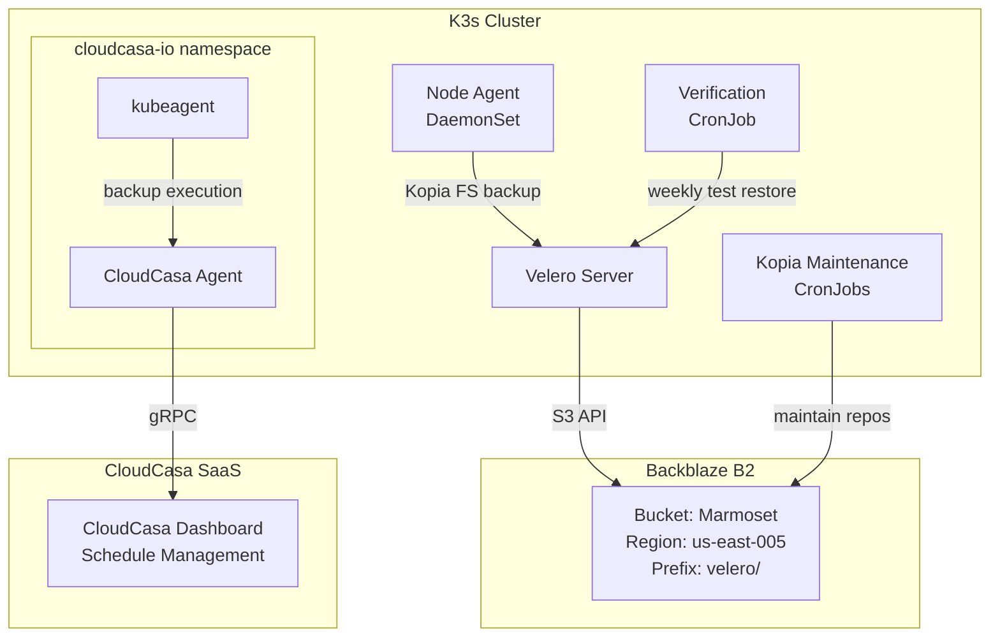

# Backup Strategy

The platform uses a two-tier backup architecture: **Velero** with Backblaze B2 for self-managed, Git-auditable backups, and **CloudCasa** as a SaaS-managed secondary layer.

## Architecture



## Velero (Primary)

Velero v1.14.0 handles all scheduled backups with file-system–level PV protection via Kopia.

### Backup Schedules

| Schedule | Cron | Retention | Last Run |
|----------|------|-----------|----------|
| **Daily** | `0 2 * * *` (2:00 AM) | 7 days (168h) | 2026-02-08 |
| **Weekly** | `0 3 * * 0` (3:00 AM Sun) | 30 days (720h) | 2026-02-08 |

Both schedules use `defaultVolumesToFsBackup: true`, meaning all PVs are backed up at the filesystem level through Kopia rather than relying on CSI volume snapshots.

### Protected Namespaces

```yaml
includedNamespaces:
  - default
  - monitoring
  - microservices
  - vertex-platform
  - argocd
  - cert-manager
  - gpu-operator
  - keel
```

### Storage Backend

| Setting | Value |
|---------|-------|
| **Provider** | AWS-compatible (Backblaze B2) |
| **Endpoint** | `s3.us-east-005.backblazeb2.com` |
| **Bucket** | `Marmoset` |
| **Prefix** | `velero/` |
| **Path style** | `s3ForcePathStyle: true` |
| **Access mode** | ReadWrite |

Credentials are stored as a Kubernetes Secret in the `velero` namespace.

### Kopia Maintenance

Velero runs Kopia repository maintenance jobs on a per-namespace basis. These compact, deduplicate, and verify the backup repository in B2:

| Namespace | Frequency |
|-----------|-----------|
| default | ~65 min |
| argocd | ~65 min |
| microservices | ~65 min |
| monitoring | ~65 min |
| vertex-platform | ~65 min |

### Components

| Component | Type | Purpose |
|-----------|------|---------|
| `velero` Deployment | Server | Backup orchestration, schedule management, S3 communication |
| `node-agent` DaemonSet | Agent | Filesystem-level PV backup via Kopia on each node |
| `velero-backup-verify` CronJob | Verifier | Weekly automated restore validation |

## CloudCasa (Secondary)

CloudCasa provides a SaaS-managed backup layer. The agent runs in the `cloudcasa-io` namespace and communicates with CloudCasa's control plane — backup schedules and policies are managed from the CloudCasa web dashboard rather than through in-cluster CRDs.

| Component | Purpose |
|-----------|---------|
| `cloudcasa-kubeagent-manager` | Agent lifecycle management |
| `kubeagent` (2 containers) | Backup execution and data movement |

CloudCasa's CRDs (backups, restores, schedules, volume snapshot locations) are registered in the cluster but orchestrated from the SaaS side, providing an independent backup path that doesn't share Velero's storage or failure modes.

## What's Protected

### Stateful Data (Active Backup)

The following PVCs are actively backed up via Velero's filesystem-level Kopia snapshots:

| Namespace | PVC | Size | Storage Class |
|-----------|-----|------|---------------|
| **default** | `mongodb-educationelly-pvc` | 2Gi | local-path |
| **default** | `mongodb-educationelly-graphql-pvc` | 2Gi | local-path |
| **default** | `mongodb-intervalai-pvc` | 2Gi | local-path |
| **default** | `mongodb-data-mongodb-intervalai-0` | 8Gi | local-path |
| **default** | `postgresql-codetalk-pvc` | 2Gi | local-path |
| **default** | `redis-pvc` | 1Gi | local-path |
| **default** | `llm-models-pvc` | 100Gi | csi-s3 |
| **default** | `triton-models-pvc` | 50Gi | csi-s3 |
| **langfuse** | `data-langfuse-clickhouse-shard0-0` | 2Gi | local-path |
| **langfuse** | `langfuse-s3` | 8Gi | local-path |
| **microservices** | `mongodb` | 8Gi | local-path |
| **microservices** | `redis-data-redis-replicas-{0,1,2}` | 8Gi each | local-path |
| **microservices** | `data-vertex-kafka-*` | 5Gi | local-path |
| **monitoring** | `prometheus-*-db-*` (x2) | 50Gi each | local-path |
| **monitoring** | `prometheus-minio` | 20Gi | local-path |
| **monitoring** | `storage-prometheus-mimir-*` (x3) | 10Gi each | local-path |
| **monitoring** | `storage-prometheus-loki-0` | 5Gi | local-path |
| **monitoring** | `gotify-pvc` | 1Gi | local-path |
| **monitoring** | `alertmanager-*-db-*` | 2Gi | local-path |
| **monitoring** | `kafka-data-prometheus-mimir-kafka-0` | 5Gi | local-path |
| **vertex-platform** | `influxdb-data-pvc` | 5Gi | local-path |
| **vertex-platform** | `influxdb-config-pvc` | 100Mi | local-path |
| **vertex-platform** | `mongodb-pvc` | 5Gi | local-path |
| **vertex-platform** | `redis-pvc` | 1Gi | local-path |

### Declarative State (Protected by GitOps)

These don't need active backup — they can be fully reconstructed from Git:

| What | Source |
|------|--------|
| All Helm charts and values | `devops-portfolio-manager` repo |
| Application source code | Individual GitHub repos |
| CI/CD workflows | GitHub Actions in each repo |
| ArgoCD Applications | Git-managed in devops-portfolio-manager |
| Docker images | Docker Hub (tagged with `YYYYMMDD-HHMMSS-shortsha`) |
| TLS certificates | Auto-issued by cert-manager + Let's Encrypt |
| Secrets definitions | Doppler (source of truth) + ESO manifests in Git |

:::info Design Principle
If it's declarative and lives in Git, GitOps is the backup. Active backup targets only **stateful data** that can't be reconstructed: database contents, persistent volumes, and monitoring history.
:::

## Automated Verification

A weekly CronJob (`velero-backup-verify`) runs every Sunday at 4:00 AM and performs a full restore validation:

```
Schedule: 0 4 * * 0
Image:    velero/velero:v1.14.0
```

**Verification steps:**

1. **BSL health check** — confirms BackupStorageLocation is `Available`
2. **Latest backup lookup** — finds the most recent successful daily backup
3. **Age validation** — fails if the latest backup is older than 48 hours
4. **Test restore** — restores the `default` namespace into a temporary `velero-test-restore` namespace
5. **Status check** — verifies restore completed successfully
6. **Cleanup** — deletes the test namespace and restore object

The CronJob runs with the `velero-server` service account and has resource limits of 500m CPU / 256Mi memory.

## Restore Procedures

### Restore a Single Namespace

```bash
velero restore create --from-backup daily-backup-YYYYMMDDHHMMSS \
  --include-namespaces default
```

### Restore to a Different Namespace

```bash
velero restore create --from-backup daily-backup-YYYYMMDDHHMMSS \
  --include-namespaces default \
  --namespace-mappings default:restored-default
```

### Restore a Specific Resource

```bash
velero restore create --from-backup daily-backup-YYYYMMDDHHMMSS \
  --include-namespaces default \
  --include-resources persistentvolumeclaims,persistentvolumes \
  --selector app=bookmarked
```

### Full Cluster Recovery

1. **Reinstall K3s** on the node
2. **Install Velero** with the same B2 credentials and bucket configuration
3. **Restore infrastructure namespaces first:**
   ```bash
   velero restore create --from-backup weekly-backup-YYYYMMDDHHMMSS \
     --include-namespaces cert-manager,argocd
   ```
4. **Restore application namespaces:**
   ```bash
   velero restore create --from-backup daily-backup-YYYYMMDDHHMMSS \
     --include-namespaces default,monitoring,microservices,vertex-platform
   ```
5. **Verify ArgoCD** reconciles remaining state from Git

### List Available Backups

```bash
velero backup get --sort-by .metadata.creationTimestamp
```

### Check Backup Details

```bash
velero backup describe <backup-name> --details
velero backup logs <backup-name>
```

## Known Issues

| Issue | Impact | Status |
|-------|--------|--------|
| GPU daemonset pods not running on node | Backup warning for `gpu-operator` pods | GPU operator pods only run when GPU node is active |
| PodVolumeBackup timeout | Backup completes as `PartiallyFailed` | Large PVs (models, Prometheus) occasionally exceed the default timeout |
