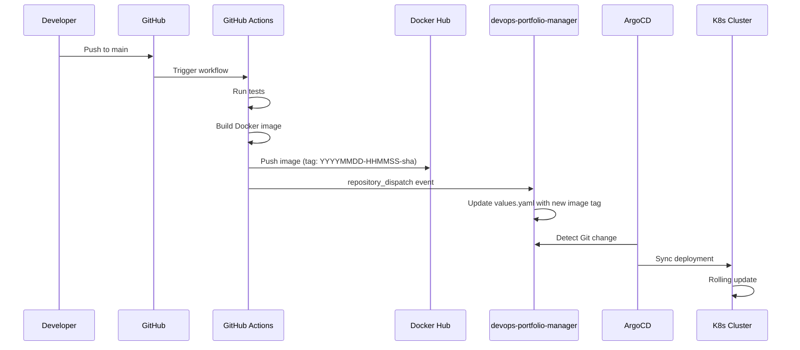

# GitHub Actions Workflows

Every application repository contains a CI/CD workflow that builds, tests, pushes a Docker image, and triggers a GitOps deployment.

## Workflow Pipeline



## Repository Dispatch Pattern

Application workflows don't directly modify the GitOps repository. Instead, they send a `repository_dispatch` event:

```yaml
# In the application repo's workflow
- name: Trigger deployment
  uses: peter-evans/repository-dispatch@v3
  with:
    token: ${{ secrets.DEPLOY_TOKEN }}
    repository: maxjeffwell/devops-portfolio-manager
    event-type: update-image
    client-payload: |
      {
        "app": "bookmarked",
        "component": "client",
        "image_tag": "${{ env.IMAGE_TAG }}"
      }
```

The `devops-portfolio-manager` repository has a workflow that receives this event and updates the corresponding `values.yaml`:

```yaml
# In devops-portfolio-manager
on:
  repository_dispatch:
    types: [update-image]

jobs:
  update:
    runs-on: ubuntu-latest
    steps:
      - uses: actions/checkout@v4
      - name: Update image tag
        run: |
          APP="${{ github.event.client_payload.app }}"
          COMPONENT="${{ github.event.client_payload.component }}"
          TAG="${{ github.event.client_payload.image_tag }}"
          sed -i "s|tag:.*|tag: \"${TAG}\"|" "${APP}/values.yaml"
      - name: Commit and push
        run: |
          git config user.name "github-actions[bot]"
          git config user.email "github-actions[bot]@users.noreply.github.com"
          git add .
          git commit -m "deploy: ${APP} ${COMPONENT} → ${TAG}"
          git push
```

## Image Tagging

All images use the `YYYYMMDD-HHMMSS-shortsha` format:

```bash
IMAGE_TAG=$(date -u +%Y%m%d-%H%M%S)-$(git rev-parse --short HEAD)
# Example: 20250205-143022-a1b2c3d
```

This provides chronological sorting, Git traceability, and collision avoidance.

## Secrets Management

CI/CD secrets are managed through **Doppler**:

- Docker Hub credentials
- GitHub deploy tokens (for repository_dispatch)
- Database connection strings
- API keys

Doppler injects secrets into GitHub Actions via the Doppler CLI or GitHub Actions integration, keeping sensitive values out of repository settings.

:::tip Live Deployments
The [Cluster Dashboard](https://el-jefe.me/cluster/) shows recent GitHub Actions workflow runs with status indicators, linking back to each run on GitHub. The [PodRick PipelineTimeline](https://showcase.el-jefe.me/?path=/story/podrick-pipelinetimeline--default) story demonstrates the pipeline visualization component.
:::
