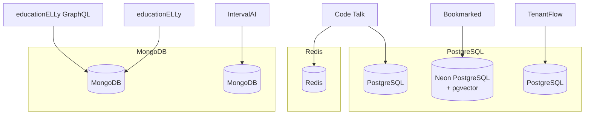

# Database Architecture

The platform uses both PostgreSQL and MongoDB, chosen based on each application's data model requirements.

## Database Dependency Map

## Technology Selection

| Database | Applications | Rationale |
|----------|-------------|-----------|
| **PostgreSQL (Neon + pgvector)** | Bookmarked | Semantic search with vector embeddings, relational bookmark/tag structure |
| **PostgreSQL** | Code Talk, TenantFlow | Relational data with strong consistency requirements |
| **MongoDB** | educationELLy, educationELLy GraphQL, IntervalAI | Flexible document schemas for educational content and flashcards |
| **Redis** | Code Talk | Session caching and real-time pub/sub for chat functionality |

## PostgreSQL

### Bookmarked (Neon + pgvector)

Bookmarked uses [Neon](https://neon.tech) serverless PostgreSQL with the `pgvector` extension for semantic search:

- **pgvector embeddings**: Bookmark descriptions are embedded as vectors for similarity search
- **Full-text search**: PostgreSQL `tsvector` for keyword-based search
- **Tag system**: Many-to-many relationship between bookmarks and tags

### Code Talk

Code Talk uses PostgreSQL for:

- User accounts and authentication
- Chat rooms and message history
- Code snippet storage with syntax highlighting metadata

### TenantFlow

TenantFlow uses PostgreSQL with tenant isolation:

- Row-level security for multi-tenant data isolation
- Tenant-specific configuration and settings

## MongoDB

### educationELLy / educationELLy GraphQL

Both applications share a MongoDB instance for:

- Lesson plans with nested exercise structures
- Student progress tracking with embedded documents
- Flexible content schemas that vary by lesson type

### IntervalAI

IntervalAI uses MongoDB for:

- Flashcard decks with spaced repetition metadata
- User learning history and interval schedules
- AI-generated card content storage
