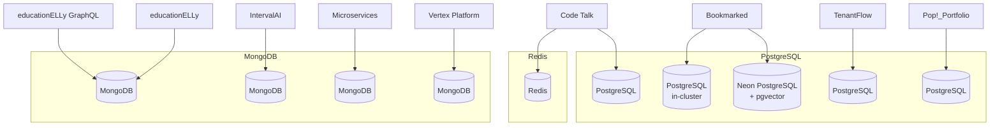

# Database Architecture

The platform uses both PostgreSQL and MongoDB, chosen based on each application's data model requirements.

## Database Dependency Map

## Technology Selection

| Database | Applications | Rationale |
|----------|-------------|-----------|
| **PostgreSQL (Neon + pgvector)** | Bookmarked | Semantic search with vector embeddings, relational bookmark/tag structure |
| **PostgreSQL (in-cluster)** | Bookmarked, Code Talk, TenantFlow, Pop!_Portfolio | Relational data with strong consistency requirements |
| **MongoDB** | educationELLy, educationELLy GraphQL, IntervalAI | Flexible document schemas for educational content and flashcards |
| **MongoDB** | Microservices, Vertex Platform | Application data in dedicated namespaces |
| **Redis** | Code Talk | Session caching and real-time pub/sub for chat functionality |

## PostgreSQL

### Bookmarked

Bookmarked uses two PostgreSQL instances:

- **Neon (external)**: Serverless PostgreSQL with `pgvector` for semantic search — bookmark descriptions are embedded as vectors for similarity search, plus `tsvector` for keyword-based full-text search
- **In-cluster**: `postgresql-bookmarked` StatefulSet for the primary relational data (bookmarks, tags, users) — backed up daily via `pg_dump` CronJob

### Code Talk

Code Talk uses PostgreSQL for:

- User accounts and authentication
- Chat rooms and message history
- Code snippet storage with syntax highlighting metadata

### TenantFlow

TenantFlow uses PostgreSQL with tenant isolation:

- Row-level security for multi-tenant data isolation
- Tenant-specific configuration and settings

## MongoDB

### educationELLy / educationELLy GraphQL

Both applications share a MongoDB instance for:

- Lesson plans with nested exercise structures
- Student progress tracking with embedded documents
- Flexible content schemas that vary by lesson type

### IntervalAI

IntervalAI uses MongoDB for:

- Flashcard decks with spaced repetition metadata
- User learning history and interval schedules
- AI-generated card content storage

## Namespace-Isolated Databases

### Microservices Namespace

The `microservices` namespace runs its own MongoDB instance (`mongodb`) and Redis cluster (`redis-replicas-{0,1,2}`). These are isolated from the default namespace databases via Kubernetes namespace boundaries.

### Vertex Platform Namespace

The `vertex-platform` namespace runs MongoDB, Redis, and InfluxDB:

- **MongoDB**: Application data storage
- **Redis**: Caching and session management
- **InfluxDB**: Time-series data for platform metrics

### Pop!_Portfolio

Pop!_Portfolio uses an in-cluster PostgreSQL instance for application data storage.
