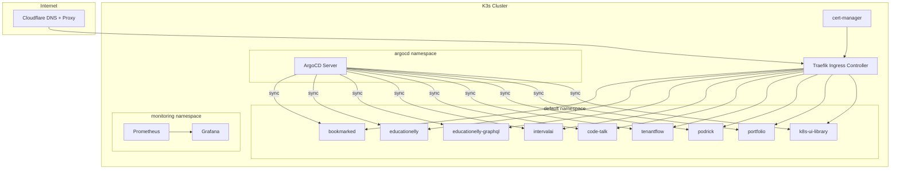

# K8s Platform Architecture

A self-hosted Kubernetes platform running **9 full-stack applications** on a K3s cluster, managed through GitOps with ArgoCD and automated CI/CD pipelines.

## Platform at a Glance

| Layer | Technology |
|-------|-----------|
| **Cluster** | K3s (lightweight Kubernetes) |
| **GitOps** | ArgoCD with automated sync, prune, and self-heal |
| **CI/CD** | GitHub Actions → Docker Hub → ArgoCD |
| **Ingress** | Traefik with Cloudflare DNS proxy |
| **TLS** | cert-manager with Let's Encrypt |
| **Secrets** | Doppler + External Secrets Operator |
| **Monitoring** | Prometheus + Grafana |
| **Helm** | `portfolio-common` library chart shared across all apps |

## Deployed Applications

| App | Stack | Database |
|-----|-------|----------|
| **Bookmarked** | React, Node.js, Express | PostgreSQL (Neon + pgvector) |
| **educationELLy** | React, Node.js, Express | MongoDB |
| **educationELLy GraphQL** | React, Apollo, Node.js | MongoDB |
| **IntervalAI** | React, Node.js, Express | MongoDB |
| **Code Talk** | React, Node.js, Express | PostgreSQL, Redis |
| **TenantFlow** | React, Node.js, Express | PostgreSQL |
| **PodRick** | React | — (K8s API) |
| **Portfolio** | Gatsby | — (static) |
| **k8s-ui-library** | Storybook | — (static) |

## Architecture Diagram

## Live Dashboards

- **[Cluster Dashboard](https://el-jefe.me/cluster/)** — Live K8s metrics, ArgoCD application health, and recent deployments
- **[Component Showcase](https://showcase.el-jefe.me)** — Interactive Storybook with extracted components from all 9 applications
- **[Portfolio Storybook](https://el-jefe.me/storybook/)** — Portfolio site component library

## Documentation Sections

- **[Architecture](/architecture/overview)** — High-level system design and GitOps workflow
- **[Kubernetes](/kubernetes/cluster-topology)** — Cluster topology, Helm charts, HPA, ArgoCD
- **[Networking](/networking/traefik)** — Traefik ingress, TLS, middleware, and domain routing
- **[Security](/security/secrets-management)** — Doppler secrets management, RBAC, and service accounts
- **[Databases](/databases/overview)** — PostgreSQL, MongoDB, and Redis instances
- **[Applications](/applications/overview)** — Per-app architecture and deployment details
- **[CI/CD](/ci-cd/github-actions)** — GitHub Actions workflows and Docker build strategy
- **[Monitoring](/monitoring/prometheus)** — Prometheus metrics and Grafana dashboards
- **[AI / ML](/ai-ml/overview)** — Shared AI Gateway, Triton semantic search, and Langfuse observability
