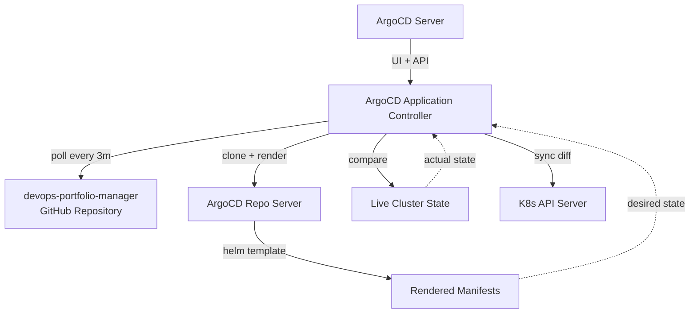

# ArgoCD Configuration

ArgoCD manages all application deployments through automated sync with the `devops-portfolio-manager` Git repository.

## Sync Policy

Every ArgoCD Application uses the same automated sync configuration:

```yaml
spec:
  syncPolicy:
    automated:
      prune: true      # Delete resources removed from Git
      selfHeal: true   # Revert manual cluster changes
    retry:
      limit: 5
      backoff:
        duration: 5s
        factor: 2
        maxDuration: 3m0s
```

### What This Means

- **Automated sync**: ArgoCD detects Git changes and applies them without manual intervention
- **Prune**: If a resource is removed from Git, ArgoCD deletes it from the cluster
- **Self-heal**: If someone manually edits a resource in the cluster, ArgoCD reverts it to match Git
- **Retry with backoff**: Failed syncs retry up to 5 times with exponential backoff (5s → 10s → 20s → 40s → 80s, capped at 3 minutes)

## Application Flow



:::tip Live Status
View real-time ArgoCD application health and sync status on the [Cluster Dashboard](https://el-jefe.me/cluster/). The PodRick dashboard app also provides K8s-native views — see the [ApplicationCard](https://showcase.el-jefe.me/?path=/story/podrick-applicationcard--default) and [PipelineTimeline](https://showcase.el-jefe.me/?path=/story/podrick-pipelinetimeline--default) stories in the Storybook Showcase.
:::

## Application Manifest Pattern

Each application's ArgoCD Application resource follows this pattern:

```yaml
apiVersion: argoproj.io/v1alpha1
kind: Application
metadata:
  name: bookmarked
  namespace: argocd
spec:
  project: default
  source:
    repoURL: https://github.com/maxjeffwell/devops-portfolio-manager
    targetRevision: HEAD
    path: bookmarked
    helm:
      valueFiles:
        - values.yaml
  destination:
    server: https://kubernetes.default.svc
    namespace: default
  syncPolicy:
    automated:
      prune: true
      selfHeal: true
    retry:
      limit: 5
      backoff:
        duration: 5s
        factor: 2
        maxDuration: 3m0s
  ignoreDifferences:
    - group: apps
      kind: Deployment
      jsonPointers:
        - /spec/replicas
```
