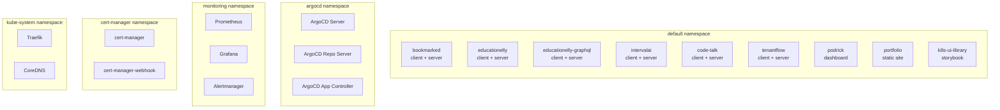
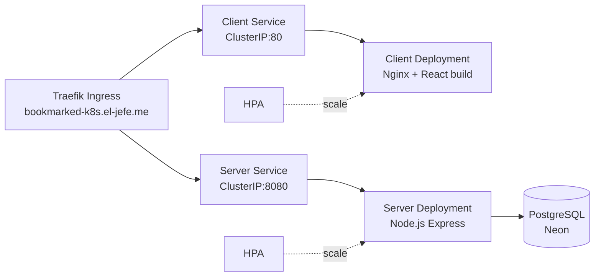

# K3s Cluster Topology

The platform runs on a K3s cluster — a lightweight, certified Kubernetes distribution optimized for edge and single-node deployments.

## Namespace Layout

## Application Deployment Pattern

Each application follows a consistent pattern:

- **Client deployment**: Nginx serving the built frontend (React/Storybook)
- **Server deployment** (where applicable): Node.js Express/Apollo API server
- **Service**: ClusterIP service for internal routing
- **Ingress**: Standard Kubernetes Ingress with `ingressClassName: traefik`
- **HPA**: Horizontal Pod Autoscaler for auto-scaling

:::tip Interactive Components
Explore extracted UI components from each application in the [Storybook Showcase](https://showcase.el-jefe.me). See the [Applications Overview](/applications/overview#component-showcase) for per-app story links.
:::

### Example: Bookmarked

