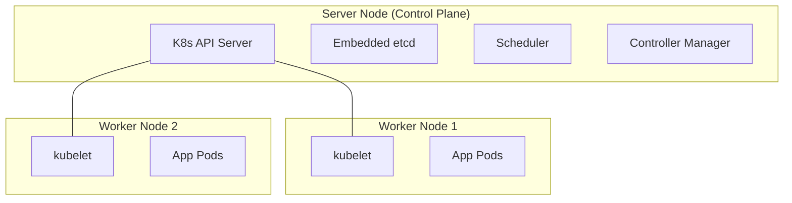
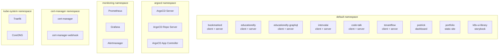
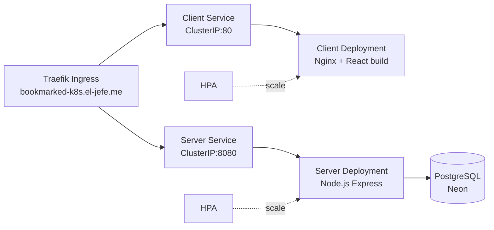

# K3s Cluster Topology

The platform runs on a **3-node K3s cluster** — a lightweight, certified Kubernetes distribution. The cluster consists of 1 server (control plane) node and 2 worker nodes.

## Node Architecture

```mermaid
graph TB
    subgraph server["Server Node (Control Plane)"]
        API[K8s API Server]
        ETCD[Embedded etcd]
        SCHED[Scheduler]
        CCM[Controller Manager]
    end

    subgraph worker1["Worker Node 1"]
        W1K[kubelet]
        W1P[App Pods]
    end

    subgraph worker2["Worker Node 2"]
        W2K[kubelet]
        W2P[App Pods]
    end

    API --- W1K
    API --- W2K
```

## Scheduling & Availability

The cluster uses several mechanisms to distribute workloads and maintain availability across the 3 nodes:

- **Soft node affinity**: Applications use `preferredDuringSchedulingIgnoredDuringExecution` instead of hard `nodeSelector`, allowing the scheduler flexibility when nodes are under pressure
- **Topology spread constraints**: Multi-replica deployments spread pods across nodes using `topologySpreadConstraints` with `maxSkew: 1`
- **PriorityClasses**: Cluster-wide priority classes ensure critical workloads (databases, ingress, monitoring) are scheduled before lower-priority pods during resource contention
- **Resource quotas**: Namespace-level resource quotas prevent any single namespace from consuming all cluster resources

## Namespace Layout

```mermaid
graph TB
    subgraph ns-default["default namespace"]
        direction TB
        BK[bookmarked<br/>client + server]
        ED[educationelly<br/>client + server]
        EG[educationelly-graphql<br/>client + server]
        IA[intervalai<br/>client + server]
        CT[code-talk<br/>client + server]
        TF[tenantflow<br/>client + server]
        PR[podrick<br/>dashboard]
        PF[portfolio<br/>static site]
        UI[k8s-ui-library<br/>storybook]
    end

    subgraph argocd namespace
        ACS[ArgoCD Server]
        ARC[ArgoCD Repo Server]
        AAC[ArgoCD App Controller]
    end

    subgraph monitoring namespace
        PM[Prometheus]
        GF[Grafana]
        AM[Alertmanager]
    end

    subgraph cert-manager namespace
        CMG[cert-manager]
        CMW[cert-manager-webhook]
    end

    subgraph kube-system namespace
        TK[Traefik]
        CRD[CoreDNS]
    end
```

## Application Deployment Pattern

Each application follows a consistent pattern:

- **Client deployment**: Nginx serving the built frontend (React/Storybook)
- **Server deployment** (where applicable): Node.js Express/Apollo API server
- **Service**: ClusterIP service for internal routing
- **Ingress**: Standard Kubernetes Ingress with `ingressClassName: traefik`
- **HPA**: Horizontal Pod Autoscaler for auto-scaling

:::tip Interactive Components
Explore extracted UI components from each application in the [Storybook Showcase](https://showcase.el-jefe.me). See the [Applications Overview](/applications/overview#component-showcase) for per-app story links.
:::

### Example: Bookmarked

```mermaid
graph LR
    TR[Traefik Ingress<br/>bookmarked-k8s.el-jefe.me] --> CS[Client Service<br/>ClusterIP:80]
    TR --> SS[Server Service<br/>ClusterIP:8080]
    CS --> CD[Client Deployment<br/>Nginx + React build]
    SS --> SD[Server Deployment<br/>Node.js Express]
    SD --> DB[(PostgreSQL<br/>Neon)]
    HPA1[HPA] -.->|scale| CD
    HPA2[HPA] -.->|scale| SD
```
