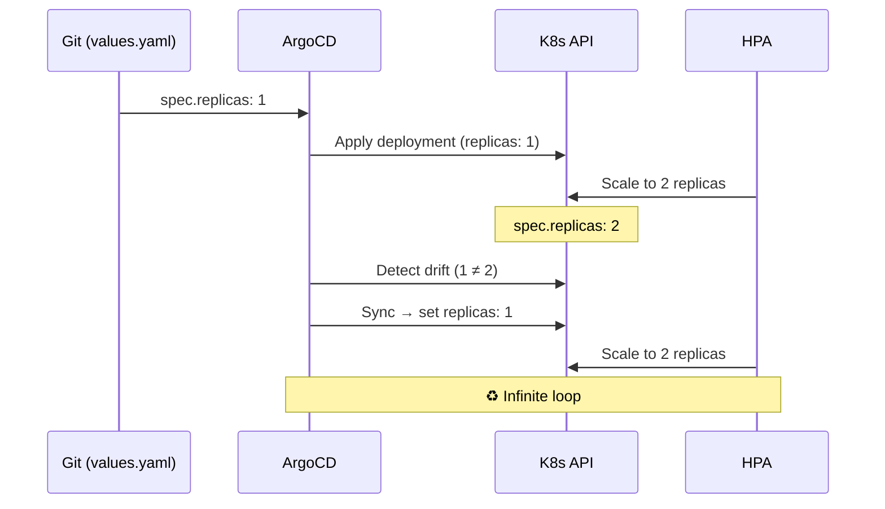

# Horizontal Pod Autoscaler

Six applications have HPA enabled for automatic scaling based on CPU utilization.

## HPA-Managed Applications

| Application | Min Replicas | Max Replicas | CPU Target |
|------------|-------------|-------------|-----------|
| bookmarked | 1 | 3 | 70% |
| educationelly | 1 | 3 | 70% |
| educationelly-graphql | 1 | 3 | 70% |
| intervalai | 1 | 3 | 70% |
| portfolio-api | 1 | 3 | 70% |
| tenantflow | 1 | 3 | 70% |

## The HPA vs ArgoCD Flapping Problem

When HPA is managing replica counts, ArgoCD can enter an infinite sync loop:



### Root Cause

The `portfolio-common` deployment template always rendered `spec.replicas`, even when HPA was enabled. ArgoCD saw the Git-declared replica count as the desired state, while HPA continuously adjusted it.

### The Fix (Two-Part)

**1. Conditional replicas in the library chart:**

```yaml
# portfolio-common/templates/_deployment.tpl
{{- if not $.Values.autoscaling.enabled }}
replicas: {{ $.Values.replicaCount }}
{{- end }}
```

When `autoscaling.enabled: true`, the `spec.replicas` field is omitted entirely, letting HPA be the sole owner.

**2. ArgoCD ignoreDifferences:**

As a safety net, ArgoCD Application manifests include:

```yaml
spec:
  ignoreDifferences:
    - group: apps
      kind: Deployment
      jsonPointers:
        - /spec/replicas
```

This tells ArgoCD to ignore the `spec.replicas` field when computing drift, preventing sync loops even if the field is present.

### Symptoms

- ArgoCD shows "OutOfSync" status with "successfully synced" message
- Pods constantly recycling (terminate → create → terminate)
- ArgoCD sync history shows rapid successive syncs
