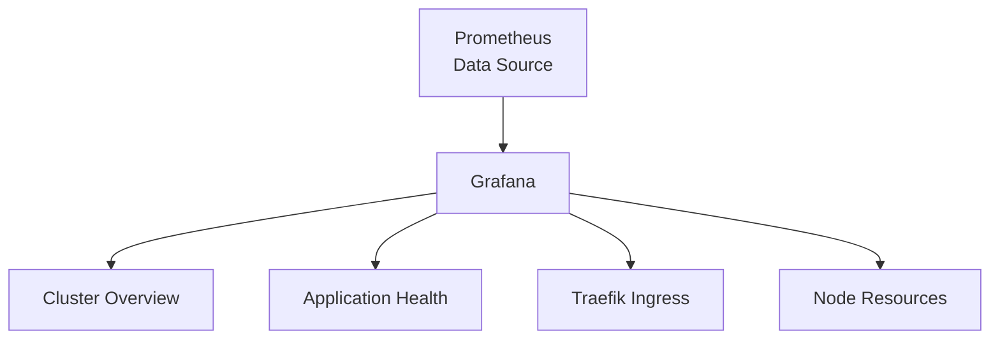

# Grafana Dashboards

Grafana provides visualization dashboards for the metrics collected by Prometheus.

## Dashboard Overview

## Key Dashboards

### Cluster Overview
- Total pod count by namespace
- Node CPU and memory utilization
- Pod restart events and crash loops
- PersistentVolume usage

### Application Health
- HTTP request rate per application
- Response time percentiles (p50, p95, p99)
- Error rate by status code
- Active connections

### Traefik Ingress
- Requests per second by host
- Backend response times
- TLS certificate expiry
- Connection counts

### Node Resources
- CPU utilization trends
- Memory usage and pressure
- Disk I/O and capacity
- Network throughput

:::tip See Also
The [Cluster Dashboard](https://el-jefe.me/cluster/) on the portfolio site provides a public view of key cluster metrics, complementing the internal Grafana dashboards. The [PodRick](https://showcase.el-jefe.me/?path=/story/podrick-workflowcard--default) stories in the Storybook Showcase demonstrate the dashboard components used for deployment monitoring.
:::
