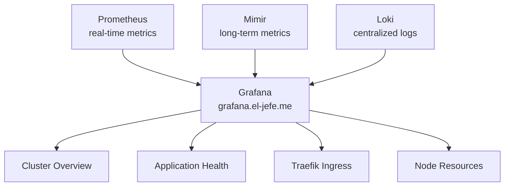

# Grafana Dashboards

Grafana provides visualization dashboards backed by three data sources: **Prometheus** (real-time metrics), **Mimir** (long-term metrics), and **Loki** (logs).

## Data Sources



### Configured Data Sources

| Data Source | Type | URL |
|------------|------|-----|
| **Prometheus** | `prometheus` | Built-in (kube-prometheus-stack default) |
| **Mimir** | `prometheus` | `http://prometheus-mimir-gateway.monitoring.svc.cluster.local/prometheus` |
| **Loki** | `loki` | `http://prometheus-loki.monitoring.svc.cluster.local:3100` |

## Configuration

Grafana is deployed as part of the kube-prometheus-stack with subdomain routing:

```yaml
grafana:
  enabled: true
  grafana.ini:
    server:
      domain: grafana.el-jefe.me
      root_url: "https://grafana.el-jefe.me/"
      serve_from_sub_path: false
  defaultDashboardsEnabled: true
  defaultDashboardsTimezone: UTC
  resources:
    requests:
      cpu: 100m
      memory: 128Mi
    limits:
      cpu: 500m
      memory: 512Mi
```

The kube-prometheus-stack provides a set of default dashboards out of the box covering Kubernetes internals, node metrics, and Prometheus self-monitoring.

## Key Dashboards

### Cluster Overview
- Total pod count by namespace
- Node CPU and memory utilization
- Pod restart events and crash loops
- PersistentVolume usage

### Application Health
- HTTP request rate per application
- Response time percentiles (p50, p95, p99)
- Error rate by status code
- Active connections

### Traefik Ingress
- Requests per second by host
- Backend response times
- TLS certificate expiry
- Connection counts

### Node Resources
- CPU utilization trends
- Memory usage and pressure
- Disk I/O and capacity
- Network throughput

## Ingress

Grafana is exposed externally via Traefik with TLS, using the same Ingress resource as Prometheus:

```yaml
rules:
  - host: grafana.el-jefe.me
    http:
      paths:
        - path: /
          pathType: Prefix
          backend:
            service:
              name: prometheus-grafana
              port:
                number: 80
tls:
  - hosts:
      - grafana.el-jefe.me
      - prometheus.el-jefe.me
    secretName: monitoring-tls
```

:::tip See Also
The [Cluster Dashboard](https://el-jefe.me/cluster/) on the portfolio site provides a public view of key cluster metrics, complementing the internal Grafana dashboards. The [PodRick](https://showcase.el-jefe.me/?path=/story/podrick-workflowcard--default) stories in the Storybook Showcase demonstrate the dashboard components used for deployment monitoring.
:::
