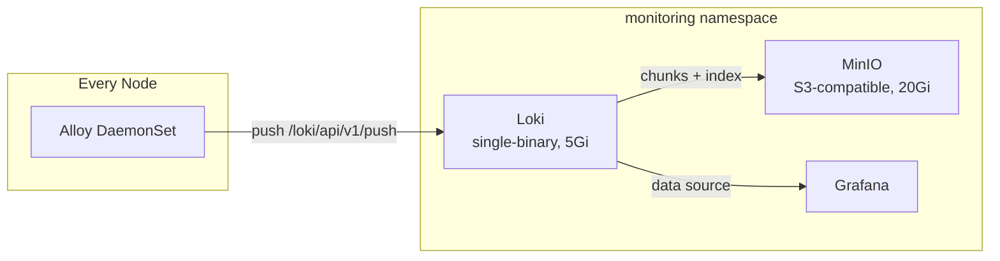

# Centralized Logging

Pod logs are collected cluster-wide by **Alloy** (DaemonSet) and aggregated in **Loki** (single-binary mode), with **MinIO** providing S3-compatible object storage for log chunks.

## Logging Pipeline



## Alloy (Log Collector)

Alloy runs as a DaemonSet on all nodes, discovering pods via the Kubernetes API and forwarding their logs to Loki:

```alloy
// Discover all Kubernetes pods
discovery.kubernetes "pods" {
  role = "pod"
}

// Relabel to extract useful metadata
discovery.relabel "pod_logs" {
  targets = discovery.kubernetes.pods.targets

  // Keep only running pods
  rule {
    source_labels = ["__meta_kubernetes_pod_phase"]
    regex         = "Pending|Succeeded|Failed|Unknown"
    action        = "drop"
  }

  // Extract: namespace, pod, container, app, node
  rule {
    source_labels = ["__meta_kubernetes_namespace"]
    target_label  = "namespace"
  }
  rule {
    source_labels = ["__meta_kubernetes_pod_name"]
    target_label  = "pod"
  }
  rule {
    source_labels = ["__meta_kubernetes_pod_container_name"]
    target_label  = "container"
  }
  rule {
    source_labels = ["__meta_kubernetes_pod_label_app"]
    target_label  = "app"
  }
  rule {
    source_labels = ["__meta_kubernetes_pod_node_name"]
    target_label  = "node"
  }
}

// Collect and forward logs
loki.source.kubernetes "pod_logs" {
  targets    = discovery.relabel.pod_logs.output
  forward_to = [loki.write.default.receiver]
}

loki.write "default" {
  endpoint {
    url = "http://prometheus-loki.monitoring.svc.cluster.local:3100/loki/api/v1/push"
  }
}
```

### Log Labels

Every log line is enriched with these labels for querying in Grafana:

| Label | Source |
|-------|--------|
| `namespace` | Pod namespace |
| `pod` | Pod name |
| `container` | Container name |
| `app` | `app` or `app.kubernetes.io/name` pod label |
| `node` | Node the pod runs on |

### Resources

```yaml
alloy:
  controller:
    type: daemonset
  resources:
    requests:
      cpu: 50m
      memory: 64Mi
    limits:
      cpu: 200m
      memory: 256Mi
```

## Loki (Log Storage)

Loki runs in single-binary mode on the VPS node with TSDB schema and S3 (MinIO) storage:

```yaml
loki:
  deploymentMode: SingleBinary
  loki:
    auth_enabled: false
    schemaConfig:
      configs:
        - from: "2024-01-01"
          store: tsdb
          object_store: s3
          schema: v13
          index:
            prefix: loki_index_
            period: 24h
    limits_config:
      retention_period: 360h
    compactor:
      retention_enabled: true
```

### Storage Layout

| Component | Backend | Bucket |
|-----------|---------|--------|
| Log chunks | MinIO S3 | `loki-chunks` |
| Ruler data | MinIO S3 | `loki-ruler` |
| Compactor work dir | Local filesystem | `/var/loki/compactor` |

### Retention

Logs are retained for **15 days** (`360h`) with compactor-based retention enforcement.

## MinIO (Object Storage)

MinIO provides S3-compatible storage shared between Loki and Mimir:

```yaml
minio:
  mode: standalone
  replicas: 1
  persistence:
    storageClass: local-path
    size: 20Gi
```

### Buckets

| Bucket | Consumer |
|--------|----------|
| `loki-chunks` | Loki log data |
| `loki-ruler` | Loki ruler data |
| `mimir-blocks` | Mimir metric blocks |
| `mimir-ruler` | Mimir ruler data |
| `mimir-alertmanager` | Mimir alertmanager data |

Credentials are managed via an ExternalSecret (`minio-credentials`) synced from Doppler.
