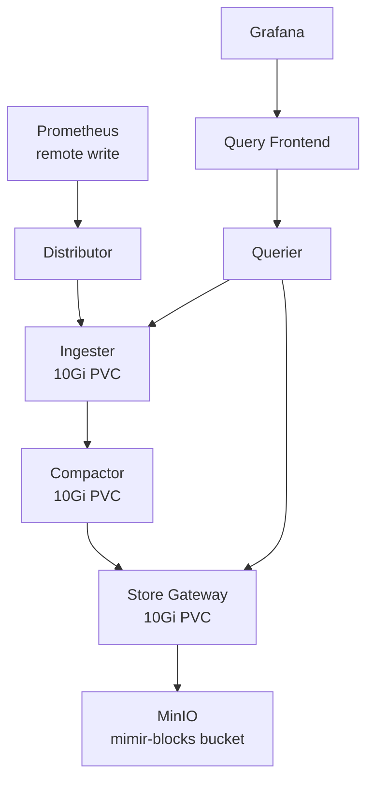

# Mimir (Long-Term Metrics)

**Grafana Mimir** provides long-term metric storage with a **90-day retention** period, extending well beyond Prometheus's 15-day local retention. Prometheus writes all metrics to Mimir via remote write, and Grafana queries Mimir as an additional Prometheus-compatible data source.

## Architecture



## Component Layout

Mimir runs in distributed mode with single replicas per component, all pinned to the VPS node:

| Component | Replicas | Storage | Resources |
|-----------|----------|---------|-----------|
| **Distributor** | 1 | — | 50m–500m CPU, 128–512Mi |
| **Ingester** | 1 | 10Gi local-path | 100m–500m CPU, 256Mi–1Gi |
| **Compactor** | 1 | 10Gi local-path | 50m–500m CPU, 128–512Mi |
| **Store Gateway** | 1 | 10Gi local-path | 50m–500m CPU, 128–512Mi |
| **Querier** | 1 | — | 50m–500m CPU, 128–512Mi |
| **Query Frontend** | 1 | — | 50m–200m CPU, 64–256Mi |

Disabled components (not needed for single-node): query_scheduler, ruler, alertmanager, overrides_exporter.

## Configuration

### Storage Backend

All Mimir components use MinIO as the S3-compatible storage backend:

```yaml
mimir:
  structuredConfig:
    common:
      storage:
        backend: s3
        s3:
          endpoint: prometheus-minio.monitoring.svc.cluster.local:9000
          insecure: true
    blocks_storage:
      s3:
        bucket_name: mimir-blocks
      tsdb:
        dir: /data/tsdb
    ruler_storage:
      s3:
        bucket_name: mimir-ruler
    alertmanager_storage:
      s3:
        bucket_name: mimir-alertmanager
```

### Retention

```yaml
limits:
  compactor_blocks_retention_period: 2160h  # 90 days
```

### Ingestion Limits

Rate limits are disabled for single-tenant operation:

```yaml
limits:
  max_global_series_per_user: 0     # unlimited
  ingestion_rate: 0                  # unlimited
  ingestion_burst_size: 0            # unlimited
```

### Replication

All replication factors are set to 1 for single-node deployment:

```yaml
ingester:
  ring:
    replication_factor: 1
store_gateway:
  sharding_ring:
    replication_factor: 1
```

## Data Flow

1. **Prometheus** writes all scraped metrics to Mimir's gateway endpoint via `remoteWrite`
2. **Distributor** receives and forwards samples to the ingester
3. **Ingester** batches samples into TSDB blocks on local disk
4. **Compactor** merges and deduplicates blocks, uploads to MinIO, enforces 90-day retention
5. **Store Gateway** serves historical blocks from MinIO for queries
6. **Querier** fans out queries to both the ingester (recent data) and store gateway (historical data)
7. **Grafana** queries Mimir through the query frontend at `http://prometheus-mimir-gateway.monitoring.svc.cluster.local/prometheus`
