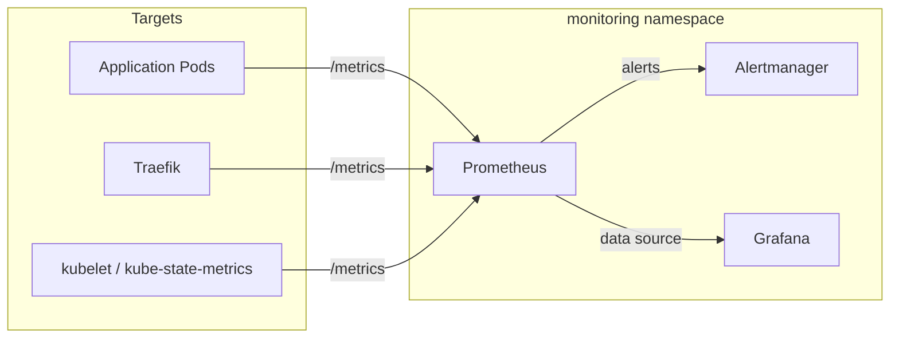

# Prometheus Monitoring

Prometheus collects metrics from all applications and cluster components via ServiceMonitor CRDs.

## Monitoring Stack



## ServiceMonitor Pattern

Each application can expose metrics via a ServiceMonitor defined in the `portfolio-common` library chart:

```yaml
apiVersion: monitoring.coreos.com/v1
kind: ServiceMonitor
metadata:
  name: bookmarked
  labels:
    release: prometheus
spec:
  selector:
    matchLabels:
      app: bookmarked
  endpoints:
    - port: http
      path: /metrics
      interval: 30s
```

## Key Metrics

| Metric Category | Examples |
|----------------|---------|
| **HTTP** | Request rate, latency percentiles, error rate |
| **Node** | CPU usage, memory pressure, disk I/O |
| **Pod** | Restart count, resource utilization vs limits |
| **HPA** | Current vs desired replicas, scaling events |
