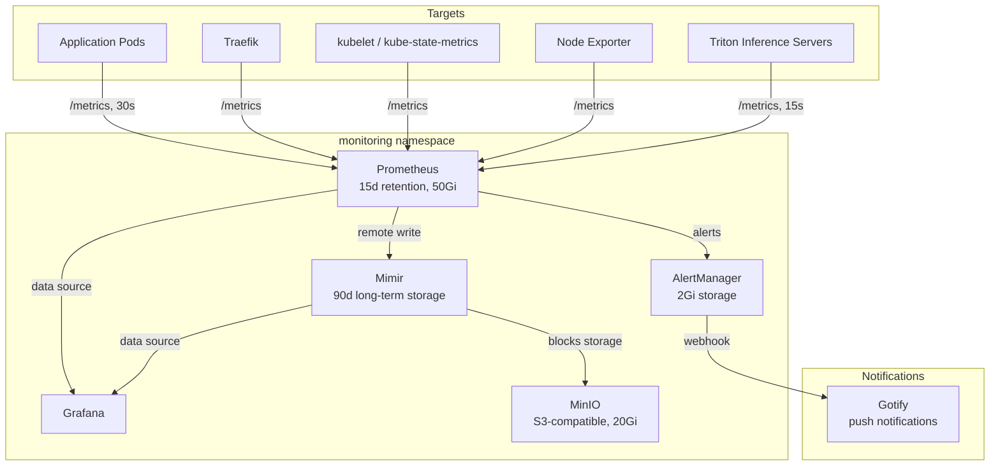

# Prometheus Monitoring

Prometheus collects metrics from all applications and cluster components, deployed via the **kube-prometheus-stack** Helm chart (v65.8.1). Metrics are retained locally for 15 days and written to **Mimir** for long-term storage (90 days).

## Monitoring Stack



## Prometheus Configuration

Prometheus runs as a single replica pinned to the VPS node, with local-path storage:

```yaml
prometheus:
  prometheusSpec:
    replicas: 1
    retention: 15d
    nodeSelector:
      kubernetes.io/hostname: vmi2951245
    storageSpec:
      volumeClaimTemplate:
        spec:
          storageClassName: local-path
          accessModes: ["ReadWriteOnce"]
          resources:
            requests:
              storage: 50Gi
    resources:
      requests:
        cpu: 200m
        memory: 512Mi
      limits:
        cpu: 1000m
        memory: 4Gi
```

### Remote Write to Mimir

All metrics are forwarded to Mimir for long-term retention beyond the 15-day local window:

```yaml
remoteWrite:
  - url: http://prometheus-mimir-gateway.monitoring.svc.cluster.local/api/v1/push
    name: mimir
    remoteTimeout: 30s
```

## ServiceMonitor Pattern

Applications are scraped via ServiceMonitor CRDs. The monitoring chart defines several:

### Portfolio Applications (label-based discovery)

Any service with the `prometheus-scrape: "true"` label is automatically discovered:

```yaml
apiVersion: monitoring.coreos.com/v1
kind: ServiceMonitor
metadata:
  name: portfolio-applications
spec:
  namespaceSelector:
    any: true
  selector:
    matchLabels:
      prometheus-scrape: "true"
  endpoints:
    - port: http
      path: /metrics
      interval: 30s
```

### Triton Inference Servers

Triton endpoints are scraped at a higher frequency (15s) for inference monitoring:

```yaml
apiVersion: monitoring.coreos.com/v1
kind: ServiceMonitor
metadata:
  name: triton-amd
spec:
  endpoints:
    - interval: 15s
      path: /metrics
      port: metrics
  namespaceSelector:
    matchNames:
      - default
  selector:
    matchLabels:
      app: triton-amd
```

Three Triton ServiceMonitors exist: `triton-amd` (CPU inference on VPS), `triton-embeddings` (VPS), and `triton-gpu` (local GPU node).

## All ServiceMonitors

| ServiceMonitor | Target | Interval | Namespace |
|---------------|--------|----------|-----------|
| `devops-portfolio-api` | DevOps Portfolio API | 30s | default |
| `devops-portfolio-dashboard` | DevOps Portfolio Dashboard | 30s | default |
| `portfolio-applications` | Any service with `prometheus-scrape: "true"` | 30s | any |
| `triton-amd` | Triton CPU inference | 15s | default |
| `triton-embeddings` | Triton embeddings | 15s | default |
| `triton-gpu` | Triton GPU inference | 15s | default |
| `gotify-bridge` | AlertManager-Gotify bridge | 30s | monitoring |
| `minio` | MinIO object storage | — | monitoring |

## Key Metrics

| Metric Category | Examples |
|----------------|---------|
| **HTTP** | Request rate, latency percentiles, error rate |
| **Node** | CPU usage, memory pressure, disk I/O |
| **Pod** | Restart count, resource utilization vs limits |
| **HPA** | Current vs desired replicas, scaling events |
| **Triton** | Inference request count, queue time, compute time |
| **Backup** | Velero backup success/failure counts, last successful timestamp |

## Ingress

Prometheus is exposed externally via Traefik with TLS:

```yaml
annotations:
  traefik.ingress.kubernetes.io/router.entrypoints: websecure
  traefik.ingress.kubernetes.io/router.tls: "true"
  cert-manager.io/cluster-issuer: letsencrypt-prod-dns
rules:
  - host: prometheus.el-jefe.me
```

:::tip Live Metrics
The [Cluster Dashboard](https://el-jefe.me/cluster/) displays live Prometheus metrics including node count, pod count, and CPU/memory utilization sourced from the devops-portfolio-manager API.
:::
