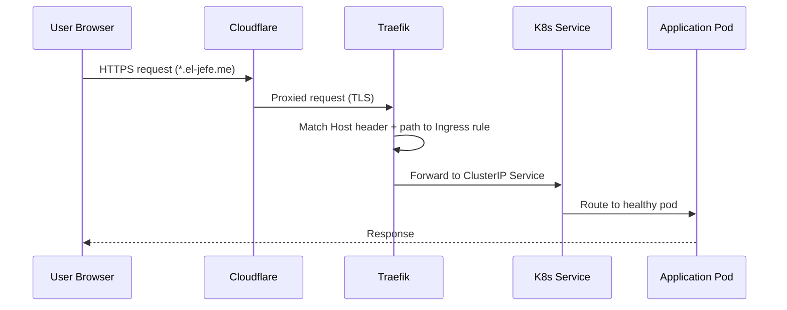
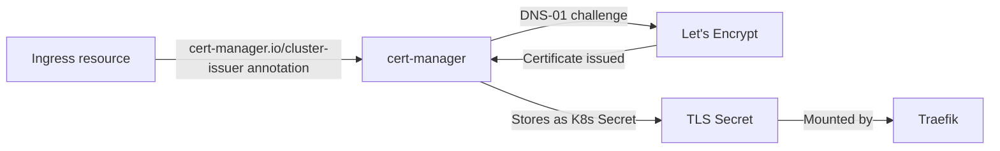

# Traefik Ingress Controller

Traefik serves as the single entry point for all external traffic into the cluster, handling TLS termination, routing, middleware, and load balancing. It runs in the `kube-system` namespace and watches both standard Kubernetes `Ingress` resources and Traefik-native `IngressRoute` CRDs.

## How Traffic Flows

Every request from the internet follows this path before reaching an application pod:



For routes with middleware (such as the DevOps API), Traefik applies middleware processing between matching the route and forwarding to the service.

## Ingress Configuration

Most applications use standard Kubernetes `Ingress` resources with the `traefik` ingress class. Each app's Helm chart includes an `ingress.yaml` template that generates the routing rules from values:

```yaml
apiVersion: networking.k8s.io/v1
kind: Ingress
metadata:
  name: bookmarked-ingress
  annotations:
    cert-manager.io/cluster-issuer: letsencrypt-prod-dns
spec:
  ingressClassName: traefik
  tls:
    - hosts:
        - bookmarked-k8s.el-jefe.me
      secretName: bookmarked-tls
  rules:
    - host: bookmarked-k8s.el-jefe.me
      http:
        paths:
          - path: /
            pathType: Prefix
            backend:
              service:
                name: bookmarked-client
                port:
                  number: 80
```

### Dual-Ingress Pattern

Apps with separate client and API backends use two `Ingress` resources on the same hostname, distinguished by path and priority annotations:

```yaml
# Client ingress (lower priority number = default catch-all)
metadata:
  annotations:
    traefik.ingress.kubernetes.io/router.priority: "100"
rules:
  - host: educationelly-k8s.el-jefe.me
    paths:
      - path: /
        backend:
          service: { name: educationelly-client, port: 3000 }

# API ingress (higher priority number = matches first for specific paths)
metadata:
  annotations:
    traefik.ingress.kubernetes.io/router.priority: "200"
rules:
  - host: educationelly-k8s.el-jefe.me
    paths:
      - path: /api
        backend:
          service: { name: educationelly-server, port: 8080 }
```

This pattern is used by educationELLy, educationELLy GraphQL, and Code Talk.

### IngressRoute CRDs

The DevOps API on `podrick.el-jefe.me` uses Traefik's native `IngressRoute` CRD for more expressive routing with composable middleware:

```yaml
apiVersion: traefik.io/v1alpha1
kind: IngressRoute
metadata:
  name: podrick-api-route
spec:
  entryPoints:
    - websecure
  routes:
    - match: Host(`podrick.el-jefe.me`) && PathPrefix(`/devops-api`)
      kind: Rule
      services:
        - name: devops-portfolio-api
          port: 5001
      middlewares:
        - name: strip-devops-api-prefix
  tls:
    secretName: podrick-tls
```

## Middleware

Traefik middlewares are defined as CRDs and referenced by `IngressRoute` resources. The cluster currently uses two middlewares for the DevOps API:

### Strip Prefix

Removes the `/devops-api` path prefix before forwarding requests to the API service, so the application sees clean paths:

```yaml
apiVersion: traefik.io/v1alpha1
kind: Middleware
metadata:
  name: strip-devops-api-prefix
spec:
  stripPrefix:
    prefixes:
      - /devops-api
```

### CORS

Cross-origin resource sharing headers for the DevOps API, allowing the portfolio site to make requests:

```yaml
apiVersion: traefik.io/v1alpha1
kind: Middleware
metadata:
  name: devops-api-cors
spec:
  headers:
    accessControlAllowOriginList:
      - "https://el-jefe.me"
    accessControlAllowMethods:
      - GET
      - POST
      - OPTIONS
    accessControlAllowHeaders:
      - Content-Type
      - Authorization
    accessControlMaxAge: 86400
```

### Sticky Sessions

Code Talk uses Traefik's cookie-based session affinity (via Ingress annotations) to ensure WebSocket and Socket.io connections consistently reach the same pod:

```yaml
annotations:
  traefik.ingress.kubernetes.io/service.sticky.cookie: "true"
  traefik.ingress.kubernetes.io/service.sticky.cookie.name: "code-talk-affinity"
  traefik.ingress.kubernetes.io/service.sticky.cookie.httponly: "true"
  traefik.ingress.kubernetes.io/service.sticky.cookie.secure: "true"
  traefik.ingress.kubernetes.io/service.sticky.cookie.samesite: "strict"
```

## TLS Certificate Management

Certificates are provisioned by cert-manager using Let's Encrypt with DNS-01 challenges, not by Traefik directly:



- **Cluster Issuer:** `letsencrypt-prod-dns`
- **Challenge type:** DNS-01 (supports any subdomain without exposing port 80)
- **Auto-renewal:** Certificates renew automatically before expiry
- **Wildcard:** Not used -- each subdomain gets its own certificate

## Domain Routing Map

### Portfolio Applications

| Domain | Application | Routing |
|--------|-------------|---------|
| `portfolio.el-jefe.me` | Portfolio Gatsby | Single ingress, client only |
| `bookmarked-k8s.el-jefe.me` | Bookmarked | Single ingress, client only |
| `firebook-k8s.el-jefe.me` | Firebook | Single ingress, client only |
| `code-talk-k8s.el-jefe.me` | Code Talk | Dual ingress with sticky sessions |
| `educationelly-k8s.el-jefe.me` | educationELLy | Dual ingress (client + `/api`) |
| `educationelly-graphql-k8s.el-jefe.me` | educationELLy GraphQL | Dual ingress (client + `/graphql`) |
| `intervalai-k8s.el-jefe.me` | IntervalAI | Single ingress, client + server |
| `showcase.el-jefe.me` | k8s-ui-library (Storybook) | Single ingress, client only |

### Infrastructure

| Domain | Application | Routing |
|--------|-------------|---------|
| `gateway.el-jefe.me` | Gateway | Single ingress, GraphQL API |
| `podrick.el-jefe.me` | PodRick Dashboard | Ingress (dashboard) + IngressRoute (`/devops-api`) |
| `pop-portfolio.el-jefe.me/portfolio` | Pop!\_Portfolio | Path-based routing |
| `tenantflow.el-jefe.me` | TenantFlow | Multi-tenant platform |
| `argocd.el-jefe.me` | ArgoCD | GitOps dashboard |
| `traefik.el-jefe.me` | Traefik | Ingress controller dashboard |
| `langfuse.el-jefe.me` | Langfuse | LLM observability platform |
| `litellm.el-jefe.me` | LiteLLM | AI gateway proxy |
| `gotify.el-jefe.me` | Gotify | Push notification server |
| `keel.el-jefe.me` | Keel | Automated image update policy |
| `triton.el-jefe.me` | Triton Inference Server | ML model serving (HTTP) |
| `triton-grpc.el-jefe.me` | Triton Inference Server | ML model serving (gRPC) |
| `grafana.el-jefe.me` | Grafana | Monitoring ingress |
| `prometheus.el-jefe.me` | Prometheus | Monitoring ingress |

## Network Policy

A blanket `NetworkPolicy` allows traffic from Traefik pods to all application pods in the default namespace:

```yaml
apiVersion: networking.k8s.io/v1
kind: NetworkPolicy
metadata:
  name: allow-traefik-ingress
spec:
  podSelector: {}
  ingress:
    - from:
        - namespaceSelector:
            matchLabels:
              kubernetes.io/metadata.name: kube-system
          podSelector:
            matchLabels:
              app.kubernetes.io/name: traefik
```

This is required because a `default-deny` policy restricts all ingress traffic by default. Without this policy, Traefik would be unable to forward requests to any pods.
