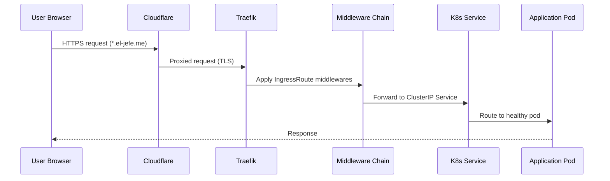
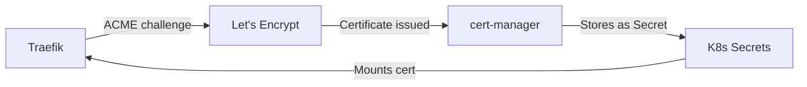

# Traefik Ingress Controller

Traefik serves as the single entry point for all external traffic into the cluster, handling TLS termination, routing, middleware, and load balancing.

## How Traffic Flows

Every request from the internet follows this path before reaching an application pod:



## IngressRoute Configuration

Each application has an `IngressRoute` custom resource that tells Traefik how to route traffic. The `portfolio-common` library chart generates these from Helm values:

```yaml
apiVersion: traefik.io/v1alpha1
kind: IngressRoute
metadata:
  name: bookmarked-client
spec:
  entryPoints:
    - websecure
  routes:
    - match: Host(`bookmarked.el-jefe.me`)
      kind: Rule
      services:
        - name: bookmarked-client
          port: 80
      middlewares:
        - name: security-headers
        - name: rate-limit
  tls:
    certResolver: letsencrypt
```

### Key Configuration Points

| Setting | Value | Purpose |
|---------|-------|---------|
| `entryPoints` | `websecure` | HTTPS on port 443 only |
| `certResolver` | `letsencrypt` | Automatic TLS certificate provisioning |
| `Host()` | Per-app subdomain | Route by hostname |
| `middlewares` | Security headers, rate limiting | Request processing chain |

## Middleware Stack

Traefik middlewares process requests before they reach the application. Each IngressRoute can compose multiple middlewares:

### Security Headers

Applied to all routes to enforce browser security policies:

```yaml
apiVersion: traefik.io/v1alpha1
kind: Middleware
metadata:
  name: security-headers
spec:
  headers:
    frameDeny: true
    contentTypeNosniff: true
    browserXssFilter: true
    referrerPolicy: "strict-origin-when-cross-origin"
    customResponseHeaders:
      X-Powered-By: ""
```

### Rate Limiting

Protects against abuse by limiting requests per source IP:

```yaml
apiVersion: traefik.io/v1alpha1
kind: Middleware
metadata:
  name: rate-limit
spec:
  rateLimit:
    average: 100
    burst: 50
    period: 1m
```

### CORS Middleware

Cross-origin resource sharing headers for API endpoints:

```yaml
apiVersion: traefik.io/v1alpha1
kind: Middleware
metadata:
  name: cors-headers
spec:
  headers:
    accessControlAllowOriginList:
      - "https://el-jefe.me"
      - "https://podrick.el-jefe.me"
    accessControlAllowMethods:
      - GET
      - POST
      - OPTIONS
    accessControlAllowHeaders:
      - Content-Type
      - Authorization
```

## TLS Certificate Management

Traefik integrates with cert-manager to automatically provision and renew Let's Encrypt certificates:



- **Issuer:** Let's Encrypt production
- **Challenge type:** HTTP-01 via Traefik
- **Auto-renewal:** Certificates renew automatically before expiry
- **Wildcard:** Not used — each subdomain gets its own certificate

## Domain Routing Map

| Domain | Application | Port |
|--------|-------------|------|
| `el-jefe.me` | Portfolio (Gatsby) | 80 |
| `bookmarked.el-jefe.me` | Bookmarked Client | 80 |
| `educationelly.el-jefe.me` | educationELLy Client | 80 |
| `educationelly-graphql.el-jefe.me` | educationELLy GraphQL Client | 80 |
| `intervalai.el-jefe.me` | IntervalAI Client | 80 |
| `code-talk.el-jefe.me` | Code Talk Client | 80 |
| `tenantflow.el-jefe.me` | TenantFlow Client | 80 |
| `podrick.el-jefe.me` | PodRick | 80 |
| `showcase.el-jefe.me` | k8s-ui-library (Storybook) | 80 |

:::tip Live Dashboard
View real-time Traefik metrics including request rates, response times, and TLS certificate status on the **[Cluster Dashboard](https://el-jefe.me/cluster/)**.
:::
