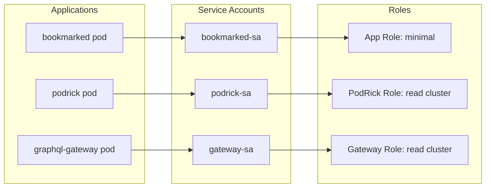

# RBAC & Service Accounts

Role-Based Access Control (RBAC) ensures that each application and operator has exactly the permissions it needs — nothing more.

## Principle of Least Privilege

Every pod runs with a dedicated `ServiceAccount`. No application shares a service account with another, and no application uses the `default` service account.



## Application Tiers

### Tier 1: Standard Applications

Most applications need no special cluster access. Their service account exists purely for identity — it has no bound roles:

```yaml
apiVersion: v1
kind: ServiceAccount
metadata:
  name: bookmarked-sa
  namespace: default
```

**Apps in this tier:** Bookmarked, educationELLy, educationELLy GraphQL, IntervalAI, Code Talk, TenantFlow

### Tier 2: Cluster-Aware Applications

PodRick and the GraphQL Gateway need read access to cluster resources for their dashboards:

```yaml
apiVersion: rbac.authorization.k8s.io/v1
kind: ClusterRole
metadata:
  name: cluster-reader
rules:
  - apiGroups: [""]
    resources: ["pods", "nodes", "namespaces", "services"]
    verbs: ["get", "list", "watch"]
  - apiGroups: ["apps"]
    resources: ["deployments", "replicasets"]
    verbs: ["get", "list", "watch"]
  - apiGroups: ["autoscaling"]
    resources: ["horizontalpodautoscalers"]
    verbs: ["get", "list", "watch"]
```

```yaml
apiVersion: rbac.authorization.k8s.io/v1
kind: ClusterRoleBinding
metadata:
  name: podrick-cluster-reader
subjects:
  - kind: ServiceAccount
    name: podrick-sa
    namespace: default
roleRef:
  kind: ClusterRole
  name: cluster-reader
  apiGroup: rbac.authorization.k8s.io
```

### Tier 3: Platform Operators

ArgoCD, External Secrets Operator, and cert-manager run with elevated permissions in their own namespaces. These are installed via Helm with their default RBAC configurations.

## Security Boundaries

| Boundary | Enforcement |
|----------|-------------|
| **Namespace isolation** | Applications in `default`, operators in dedicated namespaces |
| **Service account per app** | No shared identity between applications |
| **Read-only cluster access** | Dashboard apps can read, never modify |
| **No host networking** | Pods use cluster networking only |
| **No privileged containers** | All containers run as non-root |
