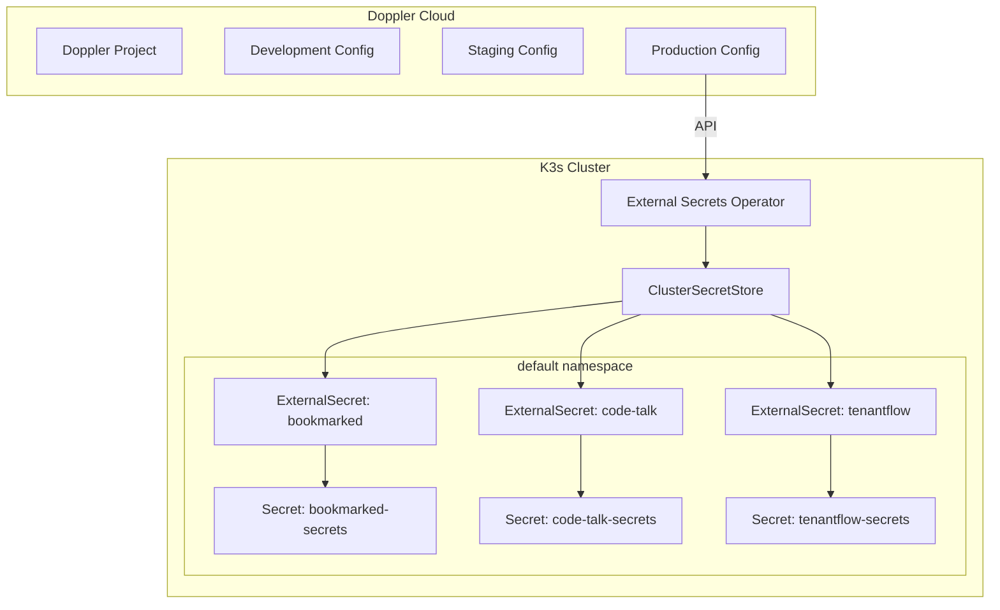

# Secrets Management

All sensitive configuration is managed through **Doppler** as the single source of truth, synced into the cluster via the **External Secrets Operator (ESO)**.

## Architecture



## How It Works

### 1. Doppler as Source of Truth

All secrets are stored in Doppler projects with environment-specific configs. Developers manage secrets through the Doppler dashboard or CLI — never directly in Kubernetes manifests.

### 2. ClusterSecretStore

A single `ClusterSecretStore` resource connects the cluster to Doppler:

```yaml
apiVersion: external-secrets.io/v1beta1
kind: ClusterSecretStore
metadata:
  name: doppler-secret-store
spec:
  provider:
    doppler:
      auth:
        secretRef:
          dopplerToken:
            name: doppler-token-auth
            key: dopplerToken
            namespace: external-secrets
```

### 3. ExternalSecret Resources

Each application that needs secrets has an `ExternalSecret` that maps Doppler keys to Kubernetes Secret keys:

```yaml
apiVersion: external-secrets.io/v1beta1
kind: ExternalSecret
metadata:
  name: bookmarked-secrets
  namespace: default
spec:
  refreshInterval: 1m
  secretStoreRef:
    name: doppler-secret-store
    kind: ClusterSecretStore
  target:
    name: bookmarked-secrets
    creationPolicy: Owner
  data:
    - secretKey: DATABASE_URL
      remoteRef:
        key: DATABASE_URL
    - secretKey: JWT_SECRET
      remoteRef:
        key: JWT_SECRET
```

### 4. Pod Consumption

Pods reference the generated Kubernetes Secret through `envFrom` or individual `valueFrom` references:

```yaml
containers:
  - name: server
    envFrom:
      - secretRef:
          name: bookmarked-secrets
```

## Secret Categories

| Category | Examples | Storage |
|----------|----------|---------|
| **Database credentials** | `DATABASE_URL`, connection strings | Doppler → ExternalSecret |
| **API keys** | GitHub tokens, service API keys | Doppler → ExternalSecret |
| **JWT secrets** | Signing keys for authentication | Doppler → ExternalSecret |
| **Docker registry** | DockerHub credentials for CI | GitHub Actions secrets |
| **ArgoCD** | Admin credentials, repo tokens | Doppler → ExternalSecret |
| **TLS certificates** | Let's Encrypt certs | cert-manager (automated) |

## Refresh and Rotation

- **Refresh interval:** ExternalSecrets poll Doppler every **1 minute**
- **Rotation workflow:** Update the secret in Doppler → ESO syncs the new value → pods pick up changes on next restart
- **No manual kubectl:** Secrets are never created or edited with `kubectl create secret`

## What's NOT in Doppler

Some values are intentionally kept as plain YAML in deployment manifests:

| Value | Reason |
|-------|--------|
| `PROMETHEUS_URL` | Internal cluster DNS, not sensitive |
| `PORT` | Application port number |
| `NODE_ENV` | Environment identifier |
| `ALLOWED_ORIGINS` | CORS origins, publicly visible in responses |

:::info Design Principle
If a value would be harmful if exposed publicly, it goes in Doppler. If it's just configuration that could appear in a README, it stays in YAML.
:::
